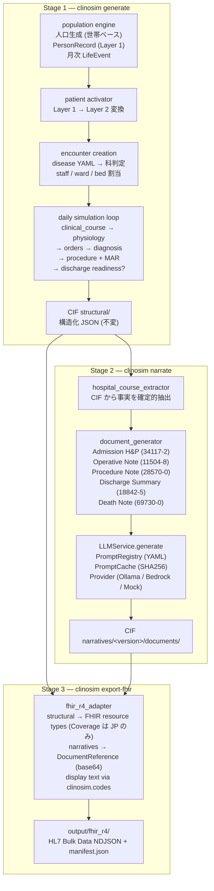
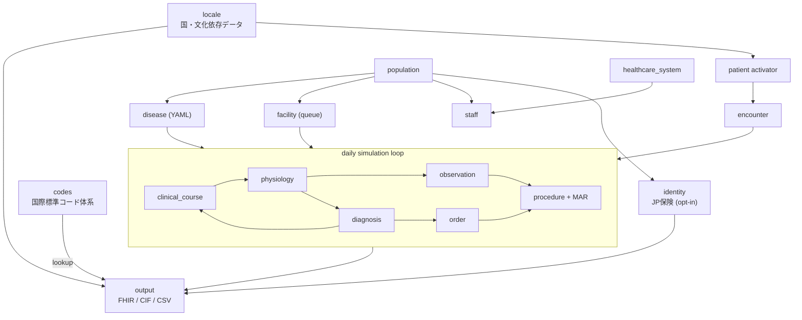

# clinosim

> **Clinically Realistic Hospital Data Simulator** — 仮想病院から FHIR R4 EHR データを生成

[](https://www.python.org/)
[](LICENSE)
[](https://hl7.org/fhir/uv/bulkdata/)
[]()

**clinosim** は人口集団から始まる **forward simulation** で合成EHRデータを生成します。 ランダム生成ではなく、 各患者に **隠れた生理学的状態 (12 変数)** を持たせ、 すべての観測 (検査、バイタル、薬剤、診断) をその状態から導出するため、 **臨床的に整合性のある** データになります。

主な用途:
- 医療AI/MLモデルの学習データ
- EHRシステムのテスト・QA
- 臨床研究のシミュレーション
- 学習用症例データ

---

## 目次

- [特徴](#特徴)
- [インストール](#インストール)
- [クイックスタート](#クイックスタート)
- [CLI リファレンス](#cli-リファレンス)
- [出力フォーマット](#出力フォーマット)
- [データフロー](#データフロー)
- [モジュール構成](#モジュール構成)
- [コード体系と権威ソース](#コード体系と権威ソース)
- [サポート疾患](#サポート疾患)
- [多国対応](#多国対応)
- [病院設定](#病院設定)
- [設計思想](#設計思想)
- [テスト](#テスト)
- [拡張方法](#拡張方法)
- [ライセンス](#ライセンス)

---

## 特徴

- **HL7 FHIR Bulk Data Access 準拠** の NDJSON 出力 (Patient.ndjson, Encounter.ndjson, ...)
- **9 状態変数による生理学モデル** で labs/vitals が物理的・臨床的に整合
- **Bayesian 鑑別診断** (尤度比表)、 6つの疾患進行アーキタイプ
- **権威コード体系** (ICD-10-CM, LOINC, RxNorm, JLAC10, YJ コード, CPT, SNOMED CT サブセット) 経由の多言語表示
- **32 疾患 + 46 ED/外来 condition** を YAML定義 (コード変更なしで追加可)
- **JCCLS 共用基準範囲 2022** に準拠した検査基準範囲
- **NEWS2 互換バイタル** (意識レベル AVPU, 補助酸素流量を含む)
- **微生物培養 + 薬剤感受性** (敗血症/肺炎/UTI/蜂窩織炎): 起因菌同定 (SNOMED) + S/I/R アンチバイオグラム → FHIR `DiagnosticReport` + `Specimen` + `Observation`
- **心筋傷害マーカー** (トロポニン I, CK-MB): physiology 由来で臨床整合 (ACS で高値、二次性は軽度、非心臓性は陰性、CKD 交絡、性別カットオフ)
- **動脈血ガス** (pH/pCO₂/pO₂/HCO₃): `ABG` オーダーを構成要素に展開 (呼吸器/代謝疾患で血ガス出力)
- **電解質 (Na) の疾患整合**: 血清 Na が疾患を反映 — 慢性心不全/肝硬変の希釈性低 Na、肺炎/心不全増悪の SIADH 低 Na、脱水の高 Na — を `sodium_status` 生理軸で実現 (疾患ドライバはデータ駆動)
- **検査値生成の venue 横断統一** (AD-57): 入院/ED/外来とも physiology 由来 → 基礎疾患が全 venue に反映 (例: CKD 患者の ED Cr が上昇)
- **AKI / DKA 入院時の臨床帯域校正**: AKI 入院時 Cr が KDIGO 2-3 帯 (p50 ~3.3 mg/dL US / ~4.1 JP — ESRD 値ではない)、DKA 入院時 HCO₃ が ADA 重症度帯 (severe <10、moderate 10-15、mild 15-18 mEq/L) に階層化。surgical (公式のみ) 校正: state 変数・coupling rules・disease YAML は不変、同一 seed で患者コホート・下流合併症が master と byte 単位一致
- **FHIR `DiagnosticReport` パネル集約** (CBC / BMP / LFT / Lipid / Coag / UA / ABG、権威 LOINC パネルコード): 同一 encounter・同日に採取された検査 Observation を panel ごとに 1 つの DR に集約し、`result[]` で構成要素 Observation を参照。既存の microbiology DR (血液/尿/喀痰/創部培養) は不変で継続出力
- **CBC / BMP パネルオーダーが正規構成要素を一括出力**(per-specimen RNG 分離):`{test:"CBC"}` の入院時オーダーは 1 specimen から WBC + Hb + Hct + Plt の 4 子 Observation を生成(`{test:"BMP"}` は 1 specimen から **canonical 8** = Na/K/Cl/HCO3/BUN/Cr/Glucose/Ca を生成)。specimen-rejection / hemolysis の RNG draw は per-parent sub-RNG(`panel_specimen_seed(parent_order_id)`)で発生するので、panel registry 編集が無関係 patient の cohort を再分配することがない(AD-16)。`min_components` 閾値は canonical N − 1 ルール(**CBC = 3、BMP = 7** Cl/Ca physiology PR 後)で audit-driven 検証済。**個別 (non-panel-child) lab order** も `individual_lab_seed(order_id)` で同様に分離され、`derive_lab_values` への将来の analyte 追加が master stream に漏れない
- **アニオンギャップ整合の塩素値** (`anion_gap_status` 軸): Cl は電気的中性のため Na に追随しつつ、HCO3 互恵で AG 軸に応じて挙動が分かれる — 高 AG アシドーシス (DKA / 敗血症 / 尿毒症) では未測定 anion が HCO3 欠損を埋めるので Cl は正常付近、non-AG アシドーシス (下痢 / RTA) では Cl が補填し高 Cl 性となる。本軸は AD-57 酸塩基二軸 (代謝/呼吸) と直交 (pH/HCO3/pCO2 に影響しない)、disease YAML で実病院 BMP に AG 変動が記録される疾患のみ設定
- **日本の保険資格** (opt-in `--jp-insurance`): 職業駆動の社保/国保/後期高齢、検証番号付き番号、マイナ保険証 → JP Core `Coverage`。マイナンバーは非出力
- **社会歴・SDOH**: 喫煙 (US Core, LOINC 72166-2 + SNOMED) / 飲酒 (LOINC 11331-6) の social-history `Observation`、および日本の **要介護度** (介護保険 区分、JP のみ、年齢駆動)
- **家族歴**: 第1度近親 (母/父/兄弟姉妹) の疾患を locale 有病率 × 遺伝性で合成 (本人の慢性疾患と相関) → FHIR `FamilyMemberHistory` (心血管代謝系 + 主要がん)
- **コードステータス** (蘇生方針): 4 段階 (Full Code/DNR/DNR+DNI/Comfort)、重篤 encounter (入院は全例、ED は重症/終末) に年齢・重症度駆動で付与 → FHIR survey `Observation` (SNOMED)
- **看護フローシート** (NEWS2/GCS/Braden/Morse) + **成人予防接種歴** (CVX, US/JP) を FHIR Observation / `Immunization` で出力
- **病棟・ベッド単位** の Location 階層、 PractitionerRole.location 紐付け
- **Snapshot date** で「現在入院中」の患者を含む状態出力 (in-progress encounter)
- **再入院チェイン** (30日以内、prior_encounter_id 紐付け)
- **多国対応** US (英語) / JP (日本語) 並列出力
- **完全 deterministic** seed指定で再現可能
- **EN優先 + 言語フォールバック** 多言語コード体系

---

## インストール

```bash
git clone https://github.com/TomoOkuyama/clinosim.git
cd clinosim
python -m venv .venv
source .venv/bin/activate          # Windows: .venv\Scripts\activate
pip install -e ".[dev]"
```

**動作要件**:
- Python 3.11+
- 主要依存: numpy, pyyaml, pydantic
- (オプション) Ollama (ローカル LLM narrative用)

---

## クイックスタート

### CLI

```bash
# デフォルト: US, 過去1年, 今日が snapshot, 40,000人 catchment, 50床hospital
clinosim generate -o ./output

# 期間指定 (--end が snapshot date)
clinosim generate -o ./output --start 2024-01-01 --end 2024-12-31

# Japan 10床 clinic
clinosim generate -o ./output \
  --country JP \
  --hospital-config clinosim/config/hospital_small.yaml \
  -p 12000

# === Stage 2: 臨床文書生成 (LLM) ===

# 日本語ナラティブ (AWS Bedrock)
clinosim narrate --cif-dir ./output/cif \
  --llm-config clinosim/config/llm_service.bedrock.yaml \
  --language ja \
  --version-id bedrock_ja_v1

# === Stage 3: FHIR Bulk Data 出力 ===

# DocumentReference 付き
clinosim export-fhir --cif-dir ./output/cif --narrative-version bedrock_ja_v1

# === デバッグ ===

# 強制シナリオ (デバッグ用)
clinosim test-disease bacterial_pneumonia -n 5 --severity moderate

# Encounter 単体テスト
clinosim test-encounter chest_pain_noncardiac --age 65 --sex M

# 利用可能な疾患・encounter 一覧
clinosim list-diseases
```

### Python API

```python
from clinosim.simulator import run_beta
from clinosim.types.config import SimulatorConfig

config = SimulatorConfig(
    catchment_population=40_000,
    country="US",
    random_seed=42,
    snapshot_date="2026-04-08",   # この日時点での EHR スナップショット
)
dataset = run_beta(config)

# 結果アクセス
for record in dataset.patients:
    enc = record.encounters[0]
    print(f"{record.patient.name.family_name}: {enc.encounter_type} → {enc.status}")
    print(f"  labs={len(record.lab_results)}, vitals={len(record.vital_signs)}")
```

### コード体系のlookup

```python
from clinosim.codes import lookup, get_system_uri

lookup("icd-10-cm", "N10", "en")
# → "Acute tubulo-interstitial nephritis"

lookup("icd-10-cm", "N10", "ja")
# → "急性腎盂腎炎"

get_system_uri("loinc")
# → "http://loinc.org"
```

---

## CLI リファレンス

### `clinosim generate`

人口駆動の population-based シミュレーション (主用途)。

| Option | デフォルト | 説明 |
|---|---|---|
| `-o, --output DIR` | `./output` | 出力ディレクトリ |
| `-p, --population N` | hospital config の `recommended_population` | catchment 人口 |
| `--country CODE` | `US` | `US` または `JP` |
| `--start YYYY-MM-DD` | end - 1年 | シミュレーション開始日 |
| `--end YYYY-MM-DD` | 今日 | シミュレーション終了日 = snapshot date |
| `--hospital-config PATH` | `clinosim/config/hospital_operations.yaml` (50床) | 病院設定 YAML |
| `--format ...` | `cif fhir` | `cif`, `csv`, `fhir`, `narrative` |
| `-s, --seed N` | `42` | 乱数 seed |
| `--narrative` | off | LLM narrative 生成 (要 Ollama) |
| `--narrative-model NAME` | `qwen:7b` | Ollama モデル名 |

### `clinosim test-disease DISEASE_ID`

特定疾患の forced scenario 生成 (デバッグ・golden test 用)。

```bash
clinosim test-disease heart_failure_exacerbation \
  --severity severe --archetype treatment_resistant -n 3
```

### `clinosim test-encounter CONDITION_ID`

ED/外来 encounter 単体テスト。

```bash
clinosim test-encounter migraine --age 35 --sex F
```

### `clinosim validate`

生成データの品質チェック (公開ベンチマーク値と比較)。

### `clinosim list-diseases`

利用可能な 32 疾患 + 46 encounter conditions を表示。

---

## 出力フォーマット

### CIF (Clinosim Intermediate Format)

```
output/cif/
├── metadata.json                  # 生成情報、 snapshot_date 等
├── hospital.json                  # staff roster + hospital config
└── structural/patients/
    └── ENC-POP-XXXXXX-NNNNNN.json # encounter ごとに 1 ファイル (構造化)
```

CIF はシミュレーションの **immutable intermediate format**。 すべての出力アダプタはここから派生。

### FHIR R4 — Bulk Data Export NDJSON 形式

[HL7 FHIR Bulk Data Access](https://hl7.org/fhir/uv/bulkdata/) 準拠:

```
output/fhir_r4/
├── manifest.json                   # Bulk Data manifest (transactionTime, output[])
├── _facility.json                  # Organization + Location マスター (Bundle)
├── Patient.ndjson                  # 1 患者 1 行
├── Encounter.ndjson                # 1 encounter 1 行
├── Observation.ndjson              # labs + vitals + AVPU + O2 + 微生物 + 看護スコア
│                                   #   (NEWS2/GCS/Braden/Morse) + 社会歴 (職業/喫煙/飲酒/要介護度)
│                                   #   + コードステータス (LOINC/SNOMED)
├── FamilyMemberHistory.ndjson      # 第1度近親の疾患歴 (v3-RoleCode + ICD)
├── Immunization.ndjson             # 成人予防接種歴 (CVX; US/JP スケジュール)
├── DiagnosticReport.ndjson         # 検査パネルレポート (CBC/BMP/LFT/Lipid/Coag/UA/ABG, LOINC) + 微生物培養レポート (+ Specimen)
├── Specimen.ndjson                 # 培養検体 (血液/尿/喀痰/創部)
├── Condition.ndjson                # 主疾患 + 慢性疾患 (ICD-10-CM)
├── MedicationRequest.ndjson        # 処方 (RxNorm)
├── MedicationAdministration.ndjson # 投与記録 (MAR)
├── Procedure.ndjson                # 手術 + ベッドサイド処置 (CPT)
├── AllergyIntolerance.ndjson       # 患者レベル (dedupされる)
├── Coverage.ndjson                 # 保険資格 (JPのみ; JP Core 被保険者番号/記号/番号/枝番)
├── Practitioner.ndjson             # 医師・看護師・技師
├── PractitionerRole.ndjson         # 専門・所属 organization・配属 location
├── Organization.ndjson             # 病院 + 各科 + 保険者 (JP)
└── Location.ndjson                 # 病棟 (ward) + ベッド (bed)
```

各行が 1 FHIR リソース。Resource.id は全リソース型で一意。 参照整合性が取れています。

### 含まれる FHIR R4 フィールド (主要)

| Resource | フィールド |
|---|---|
| Patient | identifier (MRN, type=MR), name (kanji+kana for JP), gender, birthDate, address, telecom, maritalStatus, communication (BCP-47), contact (emergency) |
| Encounter | class, type (SNOMED), serviceType, priority, period, length, participant (ATND/ADM/DIS), diagnosis ref, hospitalization (admitSource, dischargeDisposition), location (bed → ward via partOf), serviceProvider (department Org) |
| Observation | code (LOINC), valueQuantity (UCUM units + system + code), referenceRange (low/high/text/source extension for JP Core), interpretation (N/H/L/HH/LL), encounter, performer |
| Condition | code (ICD-10-CM with display), category (encounter-diagnosis / problem-list-item), severity (SNOMED), stage (NYHA, CKD G, GOLD等), clinicalStatus (active/resolved), onsetDateTime, recordedDate, encounter |
| MedicationRequest | medicationCodeableConcept (RxNorm), dosageInstruction (text + doseAndRate + timing repeat + route SNOMED), encounter, requester, reasonReference |
| MedicationAdministration | dosage (dose SimpleQuantity + route + rateQuantity for continuous), context, performer, reasonReference |
| Procedure | code (CPT), encounter, performedDateTime / performedPeriod, performer |
| Practitioner | name (with prefix), gender, telecom, qualification |
| PractitionerRole | practitioner, organization (dept), location (ward), specialty (SNOMED) |
| Location | physicalType (wa=ward, bd=bed, area), partOf (bed→ward), managingOrganization |
| Organization | hospital-main + dept-{specialty} (partOf hierarchy) |

### CSV

```
output/csv/
├── patients.csv
├── encounters.csv
├── conditions.csv
├── lab_results.csv
├── vital_signs.csv
├── orders.csv
├── medication_administrations.csv
├── procedures.csv
└── ...
```

---

## データフロー



### Snapshot semantics

- シミュレーション期間: `--start` ~ `--end`
- `--end` = **snapshot date**
- snapshot date を超えた life event は生成されない (未来日入院なし)
- snapshot date 時点で discharge_datetime が未来に来る入院は:
  - `discharge_datetime = None`
  - `Encounter.status = "in-progress"`
  - 部分的な lab/vital/order/MAR データのみ (snapshot日まで)
  - 主疾患 Condition の `clinicalStatus = "active"` (resolved されない)
- これにより**現在入院中の患者リスト**を含む現実的な EHR スナップショットになる (例: 50床×60% occupancy = ~30人 in-progress)

---

## モジュール構成

```
clinosim/
├── codes/                    # ★ 国際コード体系 + 多言語表示 (locale非依存)
│   ├── data/
│   │   ├── icd-10-cm.yaml    # 234 codes
│   │   ├── icd-10.yaml       # 133 (WHO ICD-10, JP用)
│   │   ├── loinc.yaml        # 65
│   │   ├── jlac10.yaml       # 30
│   │   ├── rxnorm.yaml       # 68
│   │   ├── yj.yaml           # 39
│   │   ├── cpt.yaml          # 31
│   │   ├── k-codes.yaml      # 25
│   │   └── snomed-ct.yaml    # 31 (サブセット: 手技構造化フィールド)
│   └── loader.py             # lookup(system, code, lang) API
│
├── locale/                   # 文化・国依存データ
│   ├── jp/, us/
│   │   ├── names.yaml        # 人名 (姓名 + 読み方)
│   │   ├── addresses.yaml    # 住所 (47都道府県/50州 + 郵便番号)
│   │   ├── demographics.yaml # 人口構成、incidence rates
│   │   ├── formatting.yaml   # 日付・単位フォーマット
│   │   ├── reference_range_lab.yaml  # JCCLS / Tietz 基準範囲
│   │   └── code_mapping_*.yaml  # 内部test name → 標準コード
│   └── shared/
│       ├── chronic_followup.yaml      # 慢性疾患の外来パターン
│       ├── chronic_medications.yaml   # 慢性疾患のhome med + monitoring
│       └── naming_rules.yaml          # 名前生成ルール
│
├── config/                   # 病院設定 YAML
│   ├── hospital_operations.yaml  # 50床 community hospital (default)
│   ├── hospital_small.yaml       # 10床 clinic
│   ├── hospital_large.yaml       # large hospital
│   ├── llm_service.yaml          # LLM (local Ollama default)
│   └── llm_service.cloud.yaml    # Anthropic API
│
├── types/                    # データ型定義 (Pydantic / dataclass)
│   ├── config.py             # SimulatorConfig
│   ├── patient.py            # PatientProfile, ChronicCondition
│   ├── clinical.py           # PhysiologicalState, ClinicalDiagnosis
│   ├── encounter.py          # Encounter, Order, VitalSignRecord, MAR
│   └── output.py             # CIFDataset, CIFPatientRecord, CIFMetadata
│
├── modules/                  # 機能モジュール (各 README あり)
│   ├── codes/                # → 上に展開
│   ├── disease/              # 32 疾患 YAML protocol
│   ├── encounter/            # 46 ED/外来 condition YAML
│   ├── physiology/           # 9 状態変数モデル + lab/vital 導出
│   ├── clinical_course/      # 6 archetype + 合併症 + diagnosis feedback
│   ├── diagnosis/            # Bayesian 鑑別診断 (LR table)
│   ├── observation/          # 3-layer 検査ノイズ + flagging
│   ├── order/                # 検査・薬剤・画像 order + 結果遅延
│   ├── procedure/            # 手術 + ベッドサイド処置 + リハビリ
│   ├── population/           # 人口・世帯生成 + life event スケジューラ
│   ├── patient/              # Layer1 → Layer2 activator
│   ├── staff/                # 病院職員 roster + 配属
│   ├── facility/             # Hospital state + M/M/1 queueing
│   ├── healthcare_system/    # 国別パラメータ (JP / US)
│   ├── identity/             # 住民識別子・保険付番 (JP, opt-in)
│   ├── output/               # CIF / FHIR R4 / CSV / narrative
│   ├── llm_service/          # Ollama + Anthropic 統合
│   └── validator/            # 公開ベンチマークとの照合
│
├── simulator/                # トップレベル orchestration
│   ├── engine.py             # run_beta, run_forced
│   ├── inpatient.py          # 入院シミュレーション
│   ├── emergency.py          # ED visit
│   ├── outpatient.py         # 外来 visit
│   ├── helpers.py            # ward/department resolver, mortality 等
│   └── cli.py                # CLI entry point
│
└── tests/
    ├── unit/                 # モジュール単体テスト (全スイート計 234 件)
    ├── integration/          # モジュール連携テスト
    └── e2e/                  # E2E + golden file テスト
```

各モジュールは **独自 README.md** を持ち、 目的/設計原則/API/データ構造/拡張方法を文書化。

---

## コード体系と権威ソース

`clinosim/codes/` は国際標準のコード体系を一元管理。 全 9 体系、 合計 **656 codes**、 全コードに英語表示あり (日本語はオプション)。

| Key | 名称 | 用途 | 権威ソース |
|---|---|---|---|
| `icd-10-cm` | ICD-10-CM | US 診断 | [CMS](https://www.cms.gov/medicare/coding-billing/icd-10-codes) |
| `icd-10` | WHO ICD-10 | JP 診断 | [WHO](https://icd.who.int/browse10/) |
| `loinc` | LOINC | 検査・バイタル | [Regenstrief](https://loinc.org/) |
| `jlac10` | JLAC10 | JP 検査 | [JCCLS](https://www.jccls.org/) |
| `rxnorm` | RxNorm | US 医薬品 | [NLM](https://www.nlm.nih.gov/research/umls/rxnorm/) |
| `yj` | YJ コード | JP 医薬品 | 厚生労働省 薬価基準 |
| `cpt` | CPT | US 手技 | [AMA](https://www.ama-assn.org/practice-management/cpt) |
| `k-codes` | K コード | JP 診療報酬手技 | 厚生労働省 診療報酬点数表 |
| `snomed-ct` | SNOMED CT (サブセット) | 手技の構造化フィールド (category, performer role, body site, outcome, complication) | [SNOMED International](https://www.snomed.org/) |

### コード体系の使い方 (FHIR Observation 例)

```python
from clinosim.codes import lookup, get_system_uri

# CIF データはコードのみ
crp_code = "1988-5"  # LOINC

# FHIR Observation に変換
obs = {
    "resourceType": "Observation",
    "code": {
        "coding": [{
            "system": get_system_uri("loinc"),
            "code": crp_code,
            "display": lookup("loinc", crp_code, "en"),
        }],
    },
    "valueQuantity": {"value": 38.2, "unit": "mg/L"},
}
```

詳細は `clinosim/codes/README.md` 参照。

---

## サポート疾患

YAML 定義で 32 疾患をサポート (急性入院の約 80% をカバー):

| カテゴリ | 疾患 |
|---|---|
| **呼吸器** | 細菌性肺炎、誤嚥性肺炎、 COPD増悪、気管支喘息増悪、インフルエンザ、肺塞栓症 |
| **循環器** | 心不全増悪、急性心筋梗塞、心房細動 (RVR) |
| **神経** | 脳梗塞、 脳出血、 慢性硬膜下血腫 |
| **消化器** | 消化管出血、急性膵炎、イレウス、肝硬変代償不全 |
| **外科** | 急性虫垂炎、急性胆嚢炎 |
| **整形** | 大腿骨頸部骨折、椎体圧迫骨折、橈骨遠位端骨折 |
| **外傷** | 重症交通外傷 |
| **代謝** | 糖尿病性ケトアシドーシス |
| **腎** | 急性腎障害 |
| **感染症** | 敗血症、尿路感染症、蜂窩織炎 |
| **血管** | 深部静脈血栓症 |
| **労災** | 手挫滅創、重症工業熱傷、高所転落、電撃傷 |

加えて **46 ED/外来 conditions** (chest pain, viral gastroenteritis, ankle sprain, annual screening, flu vaccination, dialysis session, etc.) — `clinosim/modules/encounter/reference_data/`。

新疾患追加は **YAML を追加するだけ** (コード変更なし)。 詳細は `clinosim/modules/disease/README.md`。

---

## 多国対応

| 項目 | US (default) | JP (`--country JP`) |
|---|---|---|
| 診断コード | ICD-10-CM | ICD-10 (WHO) |
| 検査コード | LOINC | JLAC10 |
| 薬剤コード | RxNorm | YJ コード |
| 手技コード | CPT | K コード |
| Display 言語 | 英語 | 日本語 (英語フォールバック) |
| 患者名 | 英語名 | 漢字 + フリガナ (extension) |
| 住所 | 米国50州 | 47都道府県 (JIS X 0401コード) |
| 検査基準範囲 | Tietz/Mayo | JCCLS共用基準範囲 2022 |
| 婚姻状態 | HL7 v3 (S/M/D/W) | 同左 |
| 言語 | en-US | ja-JP |

---

## 病院設定

`clinosim/config/hospital_*.yaml` で病院の物理構成・運営パラメータを定義:

```yaml
recommended_population: 40000  # US default; JP=5000

available_departments:           # 利用可能な診療科
  - internal_medicine
  - cardiology
  - gastroenterology
  - general_surgery
  - orthopedics
  - emergency_medicine
  - primary_care

department_rollup:              # 専門科 → 利用可能科への集約
  pulmonology: internal_medicine
  neurology: internal_medicine
  neurosurgery: general_surgery

wards:                          # 各科の病棟
  internal_medicine: ["4E", "4W"]
  cardiology: ["5E"]
  general_surgery: ["3E"]
  orthopedics: ["3W"]
  emergency_medicine: ["ER"]
  primary_care: ["OPD"]

ward_capacity:                  # 各病棟のベッド数
  "4E": 10
  "4W": 10
  "5E": 8
  "3E": 8
  "3W": 6

resource_capacity:              # 検査・画像リソース
  lab_analyzers: 2
  ct_scanners: 1
  mri_scanners: 0
  inpatient_beds: 50

staffing:                       # シフト別 staffing 比率
  day:    {hours: [8, 16],  lab_staff: 1.0, nursing_staff: 1.0}
  evening:{hours: [16, 0],  lab_staff: 0.5, nursing_staff: 0.7}
  night:  {hours: [0, 8],   lab_staff: 0.2, nursing_staff: 0.5}
```

これにより:
- 疾患 → 科 → 病棟 → ベッドの自動 routing
- M/M/1 queueing model で検査結果遅延が動的に変動
- 看護師は ward 単位で配属 (PractitionerRole.location)
- 標準セット (大病院・中規模・診療所) を切り替え可能

詳細は `clinosim/modules/facility/README.md`。

---

## 設計思想

1. **State before observation** — Lab値は独立に生成しない。 全ての観測は physiological state から導出。
2. **Process before outcome** — 診断は test result の Bayesian 推論で生まれる。 治療変更は観察可能な臨床トリガーに紐付く。
3. **Institution shapes behavior** — 同じ疾患でも医療制度 (保険、退院基準、文化) で異なるデータ。
4. **Code is the truth** — CIF はコードのみ保持、 表示は出力時に codes module で解決。
5. **YAML-driven extensibility** — 疾患追加 = YAML追加。 エンジンコード変更不要。
6. **EN-first** — 全コードに英語表示が必須、 他言語は翻訳属性。
7. **Authoritative sources** — コード値・英語表記は CMS/NLM/AMA/WHO 等の公式定義に従う。
8. **Single source of truth** — 重複データは禁止 (例: CIF に display を持たない、 codes module 経由で取得)。

---

## テスト

```bash
source .venv/bin/activate

# 全テスト (234 件; unit+integration 約2分, e2e golden 約8分)
pytest -x

# カテゴリ別
pytest -m unit                   # 単体テスト
pytest -m integration            # モジュール連携
pytest -m e2e                    # E2E + golden tests

# カバレッジ
pytest --cov=clinosim
```

---

## 拡張方法

### 新しい疾患を追加

1. `clinosim/modules/disease/reference_data/<disease_id>.yaml` を作成 (テンプレートは既存疾患を参考)
2. `clinosim/locale/<country>/demographics.yaml` の incidence list に追加
3. `clinosim/codes/data/icd-10-cm.yaml` に必要な ICD コードを追加 (まだ無ければ)
4. テスト: `clinosim test-disease <disease_id>`

詳細: `clinosim/modules/disease/README.md`

### 新しい encounter 種類 (ED/外来) を追加

1. `clinosim/modules/encounter/reference_data/<condition_id>.yaml` を作成
2. `icd10_code` と `icd10_display` を含める
3. テスト: `clinosim test-encounter <condition_id>`

### 新しい国を追加

1. `clinosim/locale/<country_code>/` フォルダ作成
2. `names.yaml`, `addresses.yaml`, `demographics.yaml`, `reference_range_lab.yaml`, `formatting.yaml` を追加
3. `clinosim/locale/shared/naming_rules.yaml` にエントリ追加
4. (オプション) 国固有のコード体系を `codes/data/` に追加

### 新しい言語を追加

`clinosim/codes/data/*.yaml` の各エントリに新言語キー追加:

```yaml
N10:
  en: "Acute tubulo-interstitial nephritis"
  ja: "急性腎盂腎炎"
  de: "Akute tubulointerstitielle Nephritis"   # 新言語
```

詳細: `clinosim/codes/README.md`

---

## モジュール依存図



`llm_service`, `validator` は cross-cutting（専用フェーズで利用）。
`identity` は opt-in enricher (AD-54): 人口生成後パスとして enricher レジストリ (AD-56) 経由で実行され、データは `output` が FHIR `Coverage` として出力。

各モジュールの詳細は `clinosim/modules/<module>/README.md` を参照。

---

## LLM 統合 (オプション)

clinosim は narrative 生成 (退院サマリ、 progress note) に LLM を利用可能。 デフォルト: ローカル Ollama。

```bash
# Ollama インストール (別途)
brew install ollama
ollama serve
ollama pull qwen:7b

# Narrative付きで生成
clinosim generate --narrative --narrative-model qwen:7b
```

LLMは structural データ生成には**不要**。 Without LLM, template-based narratives が使われる。

詳細: `clinosim/modules/llm_service/README.md`

---

## データ品質の検証

```bash
# 公開ベンチマークと比較 (LOS, mortality, complication rate)
clinosim validate -p 5000 --country US
```

公開ソース:
- JAMA, NEJM clinical guidelines
- AHRQ Healthcare Cost and Utilization Project (HCUP)
- 厚生労働省 患者調査
- OECD Health Data

詳細: `clinosim/modules/validator/README.md`

---

## 免責事項

clinosim は完全に **synthetic** なデータを生成します。 実患者情報は使用も生成もしません。 生成データはソフトウェア開発、 アルゴリズム研究、 システムテストのみを目的としています。 **臨床判断には使用しないでください**。

---

## 貢献

特に臨床医からの疾患モジュール・生理学マッピングの realism レビューを歓迎します。

```bash
git clone https://github.com/TomoOkuyama/clinosim.git
cd clinosim
python -m venv .venv
source .venv/bin/activate
pip install -e ".[dev]"
pytest
```

各モジュールの README に拡張ガイドあり。

---

## ライセンス

MIT License. See [LICENSE](LICENSE) for details.

各コード体系のデータは元のレジストリのライセンスに従う:
- ICD-10-CM, RxNorm: パブリックドメイン
- LOINC: LOINC License (商用利用無料)
- WHO ICD-10: WHO 利用規約
- CPT: AMA Copyright (educational/research subset)
- JLAC10, YJ, K-codes: 厚生労働省 / JCCLS 公開データ

---

## 引用

```bibtex
@software{clinosim,
  title  = {clinosim: Clinically Realistic Hospital Data Simulator},
  year   = {2026},
  url    = {https://github.com/TomoOkuyama/clinosim}
}
```

---

## 関連ドキュメント

- [DESIGN.md](DESIGN.md) — 詳細な設計ドキュメント (アーキテクチャ判定、 ADR)
- [TODO.md](TODO.md) — 開発ロードマップ
- [CLAUDE.md](CLAUDE.md) — Claude Code 開発ガイドライン
- [BEDROCK_SETUP.md](BEDROCK_SETUP.md) — AWS Bedrock 統合ガイド (ナラティブ生成)
- [NEXT_STEPS.md](NEXT_STEPS.md) — 次のステップと開発引き継ぎメモ
- 各モジュール `README.md` — モジュール別 API リファレンス
