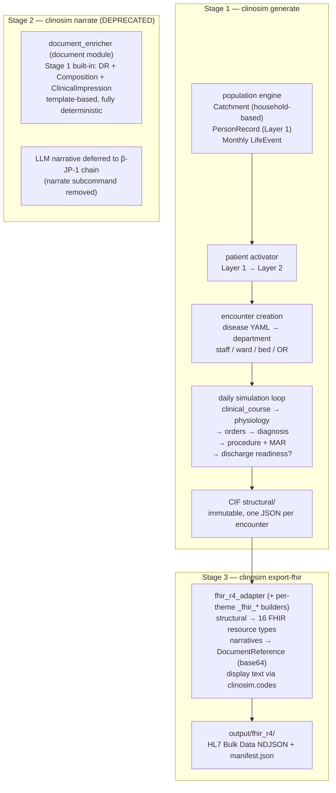
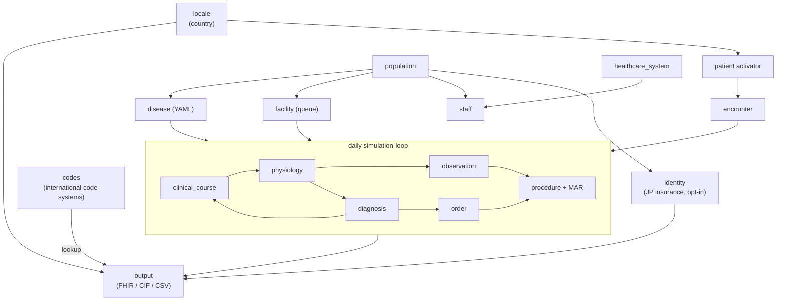

# clinosim

> **Clinically Realistic Hospital Data Simulator** — Generate FHIR R4 EHR data from a virtual hospital

[](https://github.com/TomoOkuyama/clinosim/actions/workflows/ci.yml)
[](https://tomookuyama.github.io/clinosim/)
[](https://pypi.org/project/clinosim/)
[](https://www.python.org/)
[](LICENSE)
[](https://hl7.org/fhir/uv/bulkdata/)
[]()

📚 **Documentation site**: [tomookuyama.github.io/clinosim](https://tomookuyama.github.io/clinosim/) *(deployed from `master` on every push)*

🇯🇵 **日本語版**: [README.ja.md](README.ja.md)

> ⚠️ **Personal project disclaimer**: This is an independent personal project and is **not** an official product of any company or organization. All design decisions and code are the responsibility of the individual contributors listed in `pyproject.toml`.
>
> ⚠️ **Synthetic data only**: All output is **fully synthetic**. clinosim does not ingest, reference, or reproduce any real patient data or PHI/PII. The output is **not intended for clinical use** and must not be relied upon for any diagnostic, therapeutic, or care decision.

**clinosim** generates synthetic EHR data through **forward simulation** starting from a population. Rather than producing random values, every patient carries a hidden **13-variable physiological state**, and all observations (labs, vitals, medications, diagnoses) are derived from that state — ensuring **clinically coherent** data.

Primary use cases:
- Training data for medical AI/ML models
- EHR system testing and QA
- Clinical research simulation
- Educational case datasets

---

## Why clinosim?

Most synthetic-EHR tools produce records by sampling from disease
distributions. **clinosim runs the disease.** Every patient carries a
hidden 13-variable physiological state, and every lab / vital /
medication is derived from that state. A CKD patient's ED creatinine is
elevated even when they present for something unrelated. A
warfarin-anticoagulated patient sits in the therapeutic PT-INR band. A
sepsis patient shows the WBC / CRP / lactate cascade.

Three concrete differentiators:

- **Clinical coherence by construction.** Not a post-hoc filter — the
  physiology model makes incoherent labs impossible.
- **JP + US natively.** JP Core profile compliance for 16 primary FHIR
  resource types, JLAC10 / MHLW YJ codes, JP names / addresses /
  insurance out of the box. Not an English-only tool with translations
  bolted on.
- **YAML-driven extension.** 32 inpatient diseases + 46 ED / outpatient
  conditions are all data files, not code. Adding a disease is editing
  YAML.

### How clinosim compares to Synthea

[Synthea](https://synthetichealth.github.io/synthea/) (the widely-used
state-transition simulator by MITRE) and clinosim tackle synthetic EHR
from different angles. Both are open source and both emit FHIR — the
differences are in modeling approach and locale coverage.

| Dimension | clinosim | Synthea |
|---|---|---|
| Modeling approach | Physiology-driven forward simulation (13-var hidden state per patient) | State-transition modules per condition |
| Coherence between labs / vitals | Guaranteed by shared physiological state | Independent per module |
| Native FHIR R4 output | Bulk Data Access NDJSON, one file per ResourceType | FHIR R4 JSON per patient |
| JP Core profile compliance | 16 resource types (Patient / Condition / Encounter / Observation / MedicationRequest / DiagnosticReport / Procedure / Immunization / Coverage / ...) | Not a design goal |
| Multi-locale (US + JP) | Both first-class; JP names, addresses, insurance, JLAC10, MHLW YJ | US-first; internationalization via community modules |
| Determinism guarantee | Byte-identical output within a MINOR release for the same seed | Deterministic per-run seed |
| Extension model | YAML-driven (edit a file, no code) | Java module (`.json` state machines + code) |
| Runtime | Python 3.11+ | Java 11+ |
| License | MIT | Apache 2.0 |

**When to use which:**

- **clinosim** — you need clinically coherent labs / vitals, JP output,
  or want to iterate on disease definitions without touching Java code.
- **Synthea** — you need a broad US population with well-established
  disease modules and a mature downstream tooling ecosystem.

They're not exclusive — both write FHIR, and a Synthea comparison
harness (same evaluation metrics on both sides) is on the roadmap.

### Sample output — one physiology-driven lab

For a JP patient on chronic warfarin for atrial fibrillation, clinosim
emits a PT-INR Observation like:

```json
{
  "resourceType": "Observation",
  "id": "lab-enc-jp-042-15-pt-inr",
  "meta": { "profile": [
    "http://jpfhir.jp/fhir/core/StructureDefinition/JP_Observation_LabResult"
  ]},
  "status": "final",
  "category": [{"coding": [{
    "system": "http://terminology.hl7.org/CodeSystem/observation-category",
    "code": "laboratory",
    "display": "検体検査"
  }]}],
  "code": {"coding": [
    { "system": "urn:oid:1.2.392.200119.4.504", "code": "2B160000002327101",
      "display": "PT-INR" },
    { "system": "http://loinc.org", "code": "6301-6",
      "display": "INR in Platelet poor plasma by Coagulation assay" }
  ]},
  "subject": {"reference": "Patient/jp-042"},
  "effectiveDateTime": "2026-04-15T08:00:00+09:00",
  "valueQuantity": {"value": 2.7, "unit": "{INR}",
    "system": "http://unitsofmeasure.org", "code": "{INR}"},
  "referenceRange": [{
    "low": {"value": 2.0}, "high": {"value": 3.0},
    "text": "Warfarin therapeutic (AF stroke prevention)"
  }],
  "interpretation": [{"coding": [{
    "system": "http://terminology.hl7.org/CodeSystem/v3-ObservationInterpretation",
    "code": "N",
    "display": "Normal"
  }]}]
}
```

Notice: the INR value 2.7 wasn't sampled from a "PT-INR normal range"
— the physiology engine detected warfarin from the chronic-medication
list, placed this patient in the 2.0–3.0 therapeutic band, and picked
the reference range and interpretation to match. Change the seed → a
different but still-therapeutic value. Remove the warfarin → a normal
(~1.0) INR next run. This is what "clinical coherence by construction"
means in practice.

### Demo

> 📷 **Demo GIF placeholder.** An asciinema recording of
> `clinosim generate --country JP --population 100 --seed 42` will land
> at `docs/assets/demo.gif` — see the
> [good first issues](https://github.com/TomoOkuyama/clinosim/labels/good%20first%20issue)
> tracker for the current TODO.
>
> 🖼️ **Architecture diagram placeholder.** The population → CIF → FHIR
> pipeline diagram will land at `docs/assets/pipeline.svg`. Meanwhile,
> the text walkthrough lives at
> [`docs/design-guides/data-generation-walkthrough.md`](docs/design-guides/data-generation-walkthrough.md).

---

## Table of Contents

- [Why clinosim?](#why-clinosim)
  - [How clinosim compares to Synthea](#how-clinosim-compares-to-synthea)
  - [Sample output](#sample-output--one-physiology-driven-lab)
  - [Demo](#demo)
- [Features](#features)
- [Installation](#installation)
- [Versioning & Releases](#versioning--releases)
- [Quick Start](#quick-start)
- [CLI Reference](#cli-reference)
- [Output Formats](#output-formats)
- [Data Flow](#data-flow)
- [Module Architecture](#module-architecture)
- [Code Systems & Authoritative Sources](#code-systems--authoritative-sources)
- [Supported Diseases](#supported-diseases)
- [Multi-Country Support](#multi-country-support)
- [Hospital Configuration](#hospital-configuration)
- [Design Philosophy](#design-philosophy)
- [Testing](#testing)
  - [Reproducibility](#reproducibility)
- [Datasets](#datasets)
- [Evaluation](#evaluation)
- [Extension Guide](#extension-guide)
- [Governance & Community](#governance--community)
- [License](#license)

---

## Module Map

For a single-page overview of all 30 modules, their dependencies, typical call chains, and a 5-step new-module quick-start, see **[`MODULES.md`](MODULES.md)**.

Other navigation:

| Looking for | Read |
|---|---|
| ★ **How data is generated** (population → CIF → FHIR, end-to-end for newcomers) | [`docs/design-guides/data-generation-walkthrough.md`](docs/design-guides/data-generation-walkthrough.md) |
| New-contributor reading path (concept → rules → walkthrough) | [`docs/design-guides/README.md`](docs/design-guides/README.md) |
| Scenario / medication flags | [`SCENARIO_FLAGS.md`](SCENARIO_FLAGS.md) |
| Architecture + ADR table | [`DESIGN.md`](DESIGN.md) |
| Module author HOW-TO + PR verification guide | [`docs/CONTRIBUTING-modules.md`](docs/CONTRIBUTING-modules.md) |
| New module template | [`.github/TEMPLATE_MODULE_README.md`](.github/TEMPLATE_MODULE_README.md) |

---

## Quality & Compliance

clinosim's true goal is **FHIR R4 + JP Core compliant output with clinical coherence and JP localization quality**. PRs that change output data are gated by a 3-axis Data Quality Review (structural / clinical / JP language) — see [`docs/CONTRIBUTING-modules.md`](docs/CONTRIBUTING-modules.md) "PR 検証ガイド".

Verification framework: `clinosim audit run` (AD-60) is the unified new-feature gate — 4 axes (structural / clinical / jp_language / silent_no_op) + Module-owned audit.py plug-ins. byte-diff stays as a separate refactor-PR mechanic.

Latest reviews:
- [`docs/reviews/2026-07-01-tier1-3-document-density-alpha-min-1-dqr.md`](docs/reviews/2026-07-01-tier1-3-document-density-alpha-min-1-dqr.md) — Tier 1 #3 Document Density α-min-1: **1/4 axes PASS** (silent_no_op 17/17 PASS). DocumentReference 0 → 23,760 (US) / 3,909 (JP); Composition 0 → 9,275 / 474; ClinicalImpression 0 → 23,760 / 3,909. AllergyIntolerance SNOMED upgrade. [AD-63]
- [`docs/reviews/2026-07-01-tier1-3-document-density-alpha-min-2-dqr.md`](docs/reviews/2026-07-01-tier1-3-document-density-alpha-min-2-dqr.md) — Tier 1 #3 Document Density α-min-2: **2/4 axes PASS** (clinical PASS + silent_no_op 25/25 PASS). CareTeam 0 → 158,811 (US) / 16,046 (JP) ★ GAP CLOSED. DocumentReference +22,798 (nursing shift notes). Composition +8,671 (nursing 2 types). 3 new always-on POST_ENCOUNTER Modules. [AD-64] — see [master plan](docs/design-notes/2026-06-30-tier1-document-and-event-density-master-plan.md)
- [`docs/reviews/2026-06-30-tier1-imaging-chain-dqr.md`](docs/reviews/2026-06-30-tier1-imaging-chain-dqr.md) — Tier 1 #2 Imaging chain α-min: **4 axes PASS** (structural / clinical / JP language / silent_no_op) on JP p=5k + US p=10k. ImagingStudy + Endpoint + radiology DR + imaging SR. 15/15 lift_firing_proof PASS. Bug found+fixed: encounter_id invariant for `_simulate_unknown_condition`. [AD-62]
- [`docs/reviews/2026-06-29-pr1-servicerequest-lab-dqr.md`](docs/reviews/2026-06-29-pr1-servicerequest-lab-dqr.md) — PR1 ServiceRequest lab order lifecycle: **4 axes PASS** on US p=10k + JP p=5k. 362k + 42k SR, panel SR 5.3%. [AD-61]
- [`docs/reviews/2026-06-26-phase-3b-2-hai-susceptibility-data-quality-review.md`](docs/reviews/2026-06-26-phase-3b-2-hai-susceptibility-data-quality-review.md) — Phase 3b-2 HAI culture S/I/R susceptibility chain: **all 3 axes PASS** + antibiogram firing proof + byte-diff NDJSON IDENTICAL
- [`docs/reviews/2026-06-25-clinosim-audit-baseline.md`](docs/reviews/2026-06-25-clinosim-audit-baseline.md) — first `clinosim audit run` baseline (all 4 axes for `modules/hai`; structural / jp_language / silent_no_op PASS, clinical WARN at p=2000 rare-event)
- [`docs/reviews/2026-06-25-phase3a-hai-lab-lift-data-quality-review-post-fix.md`](docs/reviews/2026-06-25-phase3a-hai-lab-lift-data-quality-review-post-fix.md) — Phase 3a HAI lift after the xhigh code-review hardening: **all 3 axes PASS** + byte-diff 37/37 NDJSON IDENTICAL + closed-form lift firing proof
- [`docs/reviews/2026-06-25-phase3a-hai-lab-lift-data-quality-review.md`](docs/reviews/2026-06-25-phase3a-hai-lab-lift-data-quality-review.md) — Phase 3a initial DQR (pre-fix; superseded by the post-fix review above)
- [`docs/reviews/2026-06-24-master-comprehensive-dqr.md`](docs/reviews/2026-06-24-master-comprehensive-dqr.md) — comprehensive master review (June 2026), **all 3 axes PASS** on master @ p=10,000 (US) + p=5,000 (JP):

- **Structural**: 3.4M + 434K Observations across 10 FHIR resource types; id uniqueness 100%; reference integrity 100%
- **Clinical**: 17 major lab analytes in clinically valid bands for both locales (DKA acidosis, ACS troponin, sepsis WBC/CRP/lactate, HF BNP, VTE D-dimer, AF warfarin therapeutic INR, etc.)
- **JP Language**: 100% Japanese display across Condition / DR / Med / Immunization / care_level / smoking / alcohol; JLAC10 codes with JCCLS-JSLM authoritative display; 0 US-locale Japanese leakage

---

## Features

- **HL7 FHIR Bulk Data Access** compliant NDJSON output (Patient.ndjson, Encounter.ndjson, ...)
- **Three-stage pipeline**: `generate` (structured CIF) → `narrate` (LLM clinical documents) → `export-fhir` (FHIR R4 NDJSON). Each stage is re-runnable and independently testable.
- **Clinical documents as FHIR DocumentReference** (LOINC-coded): Discharge Summary, Death Note, Operative Note, Admission H&P, Procedure Note — each base64-encoded and linked to Patient/Encounter/Procedure
- **Pluggable LLM providers** (Ollama, AWS Bedrock, Mock) with YAML-driven factory and SHA256 disk cache for reproducibility and cost control
- **13-variable physiology model** ensures labs/vitals are physiologically and clinically coherent
- **Bayesian differential diagnosis** with likelihood ratios; 6 disease trajectory archetypes
- **Authoritative code systems** (ICD-10-CM, LOINC, RxNorm, JLAC10, YJ codes, CPT, SNOMED CT subset) with multilingual display
- **32 diseases + 46 ED/outpatient conditions** defined in YAML (no code changes to add new ones)
- **JCCLS reference ranges 2022** for Japanese labs; Tietz/Mayo for US
- **NEWS2-compatible vitals** including AVPU consciousness level and supplemental oxygen
- **Microbiology cultures + antibiotic susceptibility** for bacterial infections (sepsis, pneumonia, UTI, cellulitis): organism identification (SNOMED) and S/I/R antibiograms — emitted as FHIR `DiagnosticReport` + `Specimen` + `Observation`. All codes data-driven (`observation/reference_data/microbiology.yaml`)
- **Cardiac injury markers** (Troponin I, CK-MB): physiology-derived and clinically coherent — MI-level in ACS, mild type-2 elevation in other cardiac stress, negative in non-cardiac rule-outs (ED chest pain/syncope), with a CKD clearance confounder and sex-specific cutoffs. Lab order aliases (stat/serial variants) canonicalize across inpatient/ED/outpatient
- **Arterial blood gas** (pH, pCO₂, pO₂, HCO₃): an `ABG` order expands into its component results (data-driven panel), so respiratory/metabolic cohorts (COPD, pneumonia, asthma, DKA) get blood-gas data
- **Dysnatremia coherence**: serum sodium tracks the disease — dilutional hyponatremia in chronic heart failure / cirrhosis, SIADH hyponatremia in pneumonia and HF exacerbation, and hypernatremia from dehydration — via a `sodium_status` physiology axis (disease drivers are data-driven)
- **Glycemic coherence**: HbA1c reflects each diabetic's chronic glycemic control (a `glycemic_control` axis, median ~6.8%, tail to ~12%), and Glucose baseline co-moves with it — so a poorly-controlled diabetic shows both high HbA1c and high glucose. Scenarios that imply poor control (DKA) drive HbA1c high even for new-onset diabetes, and the diabetes `Condition.stage` HbA1c display matches the labs.
- **Unified physiology-driven labs across venues** (AD-57): inpatient, ED, and outpatient all derive lab true values from the patient's physiological state, so comorbidities are reflected everywhere (e.g. a CKD patient's ED creatinine is elevated, not a fixed normal)
- **AKI / DKA admit-day calibration** to published clinical bands: AKI admit Creatinine sits in the KDIGO 2-3 envelope (p50 ~3.3 mg/dL US, ~4.1 JP — not ESRD-level), and DKA admit HCO₃ stratifies into the ADA severity bands (severe <10, moderate 10-15, mild 15-18 mEq/L). Surgical (formula-only) calibration: state variables, coupling rules, and disease YAMLs unchanged, so patient cohorts and downstream complications match master byte-for-byte at fixed seed
- **FHIR `DiagnosticReport` panel grouping** (CBC / BMP / LFT / Lipid / Coag / UA / ABG) with authoritative LOINC panel codes: lab Observations drawn in the same encounter-day are grouped into one DR per panel, with `result[]` references back to the component Observations. Existing microbiology DRs (blood/urine/sputum/wound culture) continue to emit unchanged
- **FHIR `ServiceRequest` lab order lifecycle** (PR1, 2026-06-29) — panel-aware grouping (CBC/BMP/LFT/ABG/Lipid/Coag/UA): 1 SR per panel instance, stand-alone orders emit 1 SR each. JP Core PLAC identifier (HL7 v2-0203), dual category coding (SNOMED 108252007 + v2-0074 LAB). US p=10k: 362k SR; JP p=5k: 42k SR; panel SR 5.3%. [AD-61]
- **Imaging metadata chain** (Tier 1 #2, 2026-06-30) — ImagingStudy (DCM modality, multi-series, urn:dicom:uid identifier), Endpoint (WADO-RS URL placeholder for future PACS / image-gen AI integration), radiology DiagnosticReport (findings + impression in `text.div` + `conclusion`), and ServiceRequest with imaging category (SNOMED 363679005 + v2-0074 RAD). PR1 scope: CR (X-ray) + CT modalities, chest + head body sites, bacterial / aspiration pneumonia + hemorrhagic stroke. [AD-62]
- **Document Density chain α-min-1** (Tier 1 #3, 2026-07-01) — Stage 1 default template-based clinical document emission: DocumentReference (Admission H&P + Progress Note + Discharge Summary, LOINC-coded, base64-encoded), Composition (structured discharge summary with 7 sections), and ClinicalImpression (daily clinical impression) for all inpatient/ICU/rehab encounters. AllergyIntolerance upgraded to 8-field SNOMED-coded schema (allergen SNOMED + reaction + category + criticality + clinical/verification status). US p=10k: 23,760 DR + 9,275 Composition + 23,760 CI; JP p=5k: 3,909 DR + 474 Composition + 3,909 CI. [AD-63]
- **Document Density chain α-min-2** (Tier 1 #3, 2026-07-01) — CareTeam FHIR resource (1:1 with Encounter, attending physician + primary nurse), 3 nursing document types (ADMISSION_NURSING_ASSESSMENT 78390-2 / NURSING_SHIFT_NOTE 34746-8 / NURSING_DISCHARGE_SUMMARY 34745-0), triage module (JTAS/ESI), 46 encounter YAML narrative extensions. US p=10k: CareTeam 158,811 + DR 46,558 + Composition 17,946. silent_no_op 25/25 PASS, clinical axis PASS. [AD-64] — see [master plan](docs/design-notes/2026-06-30-tier1-document-and-event-density-master-plan.md)
- **CBC / BMP panel orders emit canonical children** with **per-specimen RNG isolation**: a `{test:"CBC"}` admission order produces WBC + Hb + Hct + Plt as four child Observations from one specimen (and `{test:"BMP"}` produces the **full canonical 8** — Na/K/Cl/HCO3/BUN/Cr/Glucose/Ca — from one specimen), with the panel's specimen-rejection / hemolysis draws sourced from a per-parent sub-RNG (`panel_specimen_seed(parent_order_id)`) so a panel registry edit cannot cascade into unrelated patients' cohorts (AD-16). Per-panel `min_components` thresholds follow the canonical-N − 1 rule (**CBC = 3, BMP = 7** post Cl/Ca physiology PR) — validated by audit. **Individual (non-panel-child) lab orders** are likewise isolated via `individual_lab_seed(order_id)`, so any future analyte added to `derive_lab_values` cannot leak through the master stream
- **Anion-gap-aware chloride** (`anion_gap_status` axis): Cl follows Na for electroneutrality plus HCO3 reciprocity gated by the AG axis — high-AG acidosis (DKA / sepsis / uremia) keeps Cl near normal as unmeasured anion absorbs the HCO3 deficit, non-AG acidosis (diarrhea / RTA) gives hyperchloremic Cl. The axis is orthogonal to the AD-57 acid-base 2-axis (does NOT affect pH/HCO3/pCO2) and disease YAMLs set it where AG is recorded as varying in real-world BMPs
- **Coag panel activation** (LOINC 24373-3 = aPTT and PT/INR panel): `APTT`, `PT` (seconds = 12 × PT_INR ISI=1.0 invariant), and `Fibrinogen` all derive from existing `coagulation_status` + `inflammation_level` axes — APTT proportional to DIC severity, PT mathematically tied to the existing PT_INR, Fibrinogen **biphasic** (acute-phase reactant ↑ in inflammation, consumed ↓ in DIC). PR also adds `Coag` / `LFT` / `Lipid` / `UA` to `lab_panels.yaml` so panel orders can expand symmetrically with `lab_panel_groups.yaml`. AD-57 BNP-pattern surgical (formula-only, no new state field) + AD-59 per-order RNG isolation keep all additions cohort-neutral (byte-diff vs master @ p=2000 seed=42 shows zero shift in Patient/Encounter/Condition/Med/Procedure/Imaging/Immunization/FamilyHistory NDJSONs)
- **VTE-spectrum D-dimer** (LOINC 48065-7 / JLAC10 2B140): `D_dimer` derive from `coagulation_status` + `inflammation_level` + age + a new `causes_vte` scenario flag (set on PE / DVT / embolic ischemic stroke). PE / DVT / cerebral_infarction admit-day D-dimer p50 ≥ 4 ug/mL FEU (clinically positive); sepsis without VTE stays non-specific p50 < 2. Hemorrhagic stroke deliberately does NOT get the flag (intracerebral fibrinolysis is captured by `coagulation_status` alone). The scenario-flag wiring is centralized via a `scenario_flags_from_protocol(protocol)` helper — adding any future flag to `derive_lab_values` reaches every call site (inpatient / ED / outpatient) automatically. The fix also cures a latent defect where ED-route MI patients had no troponin upshift because `emergency.py` was calling `derive_lab_values` without the `causes_myocardial_injury` flag
- **Warfarin therapeutic PT-INR coupling** (Phase 2b): `PT_INR` derivation now reads a sibling `medication_flags_from_context(patient, medication_orders, admission_date, current_day)` helper that detects warfarin from (1) `patient.current_medications` (chronic AC for AF I48 + post-VTE I26 / I82 / I63 via `chronic_medications.yaml`) or (2) in-hospital warfarin orders ≥ 3 days old (loading-dose rule, peeked from `all_orders`). When `on_warfarin=True`, PT_INR overrides to 2.5 + half-gain comorbidity perturbation — so warfarin-only patients sit in the therapeutic 2.0-3.0 band, warfarin + cirrhosis (hepatic ↓) or DIC (coag ↑) compounds into 3.0-3.5 (over-AC bleeding-risk visible), and DOAC (apixaban / rivaroxaban / edoxaban / dabigatran) patients are intentionally NOT detected — INR is not clinically monitored for DOAC. US p=10000 audit: warfarin p50 INR 2.70 (therapeutic), DOAC p50 1.80 ≈ no-AC p50 1.70 (DOAC correctly unshifted). Same `**flags` merge pattern as scenario flags — adding any future medication coupling (steroid → glucose, etc.) reaches every call site through one helper edit
- **Ward + bed Location hierarchy** with PractitionerRole.location assignment
- **Operating rooms** modeled as FHIR Locations; surgical procedures include category (SNOMED), performer.function (surgeon/anaesthetist), bodySite, outcome, and complications
- **Occupational injuries**: 6 work-related conditions (crush injury, industrial burn, fall from height, electrical injury, eye foreign body, chemical exposure) with occupation-based risk multipliers
- **Patient occupation** field (12 categories) with FHIR Observation (LOINC 11341-5, social-history)
- **Social history & SDOH**: smoking status (US Core, LOINC 72166-2 + SNOMED) and alcohol use (LOINC 11331-6) social-history Observations, plus the Japanese long-term-care need level (**要介護度** / 介護保険 区分, JP only, age-driven)
- **Family history**: first-degree relatives (mother/father/siblings) with disease history synthesized from locale prevalence × heritability (correlated with the patient's own chronic conditions) — FHIR `FamilyMemberHistory` (cardiometabolic + major cancers)
- **Code status** (resuscitation status): 4-tier (Full Code / DNR / DNR+DNI / Comfort care) on serious encounters (inpatient always; ED when critical/terminal), age/acuity-driven — FHIR survey `Observation` (SNOMED)
- **Nursing flowsheets** (NEWS2 / GCS / Braden / Morse) and **adult immunization history** (CVX, US/JP schedules) as FHIR Observation / `Immunization`
- **Japanese insurance enrollment** (opt-in, `--jp-insurance`): occupation-driven 社保/国保/後期高齢者, valid 保険者番号/被保険者番号 check digits, マイナンバーカード・マイナ保険証 status — emitted as JP Core FHIR `Coverage` + 保険者 `Organization`. マイナンバー stays internal (never exported).
- **Multilingual FHIR coding**: Condition and Procedure emit dual coding entries (primary language + interop language); Condition code.text includes clinical abbreviations (COPD, CHF, CKD, DM)
- **Snapshot date** support — includes "currently admitted" patients (in-progress encounters)
- **30-day readmission chains** with `prior_encounter_id` linking
- **Multi-country**: US (English) and JP (Japanese) parallel output
- **Fully deterministic** with seed
- **English-first with language fallback** in code systems and LLM prompt templates

---

## Installation

### As a user (recommended)

Once released to PyPI, install the packaged version directly:

```bash
python -m venv .venv
source .venv/bin/activate          # Windows: .venv\Scripts\activate
pip install clinosim                # (PyPI upload pending — see fallback below)
clinosim --help
```

**Pre-PyPI fallback** — install straight from GitHub:

```bash
pip install "git+https://github.com/TomoOkuyama/clinosim.git@master"
clinosim --help
```

### As a developer (editable install with dev deps)

```bash
git clone https://github.com/TomoOkuyama/clinosim.git
cd clinosim
python -m venv .venv
source .venv/bin/activate          # Windows: .venv\Scripts\activate
pip install -e ".[dev]"
```

**Requirements**:
- Python 3.11+
- Main dependencies: numpy, scipy, pydantic, pyyaml, httpx
- (Optional) Ollama for local LLM narrative generation
- (Optional) `pip install "clinosim[parquet]"` for CIF Parquet export

---

## Versioning & Releases

clinosim follows [Semantic Versioning 2.0.0](https://semver.org/spec/v2.0.0.html):

- **MAJOR** — incompatible API / CIF / FHIR schema changes.
- **MINOR** — backward-compatible feature additions (new modules, new
  resource types, additional locale support). May change output byte-for-byte
  even at the same seed.
- **PATCH** — backward-compatible bug fixes and data-quality corrections
  that preserve the CIF/FHIR schema. **Byte-identical output within the
  same seed is a hard guarantee for PATCH releases within one MINOR line.**

### Cutting a release

Version lives in exactly one place: `clinosim/__init__.py::__version__`.
`pyproject.toml` reads it dynamically (`[tool.hatch.version]`), so PyPI
metadata, `pip show clinosim`, and `import clinosim; print(clinosim.__version__)`
never drift.

```bash
# 1. Bump the version and update the changelog
$EDITOR clinosim/__init__.py       # e.g. __version__ = "0.2.0"
$EDITOR CHANGELOG.md               # move [Unreleased] entries under [0.2.0] - YYYY-MM-DD

# 2. Commit and tag
git add clinosim/__init__.py CHANGELOG.md
git commit -m "release: v0.2.0"
git tag -a v0.2.0 -m "clinosim v0.2.0"
git push origin master --tags

# 3. Create the GitHub Release
# Draft a new release on GitHub against tag v0.2.0, paste the CHANGELOG entry
# as the release notes, and attach the built wheel + sdist:
python -m pip install --upgrade build
python -m build                    # produces dist/clinosim-0.2.0-py3-none-any.whl + .tar.gz
# then upload dist/* through the GitHub Release UI or `gh release create`.

# 4. (Once PyPI is set up) upload to PyPI
python -m pip install --upgrade twine
python -m twine upload dist/*
```

The `Changelog` URL in `pyproject.toml [project.urls]` points at
`CHANGELOG.md`, so PyPI users can reach the notes without leaving the
package listing.

---

## Quick Start

### CLI

```bash
# === Stage 1: structured simulation (always local, deterministic) ===

# Default: US, past 1 year ending today, 40,000 catchment, 50-bed hospital
clinosim generate -o ./output

# Custom period (--end is the snapshot date)
clinosim generate -o ./output --start 2024-01-01 --end 2024-12-31

# Japan 10-bed clinic
clinosim generate -o ./output \
  --country JP \
  --hospital-config clinosim/config/hospital_small.yaml \
  -p 12000

# === Stage 2: clinical documents (DEPRECATED — see note below) ===
# As of α-min-1 (2026-07-01), DocumentReference / Composition / ClinicalImpression are
# generated automatically during Stage 1 (clinosim generate --format fhir-r4).
# The clinosim narrate subcommand is deprecated and will exit with an error.
# Stage 2 LLM narrative integration is deferred to the β-JP-1 chain (see TODO.md).
#
# Legacy narrate examples (for reference only — these commands NO LONGER WORK):
#   clinosim narrate --cif-dir ./output/cif --version-id template_v1
#   clinosim narrate --cif-dir ./output/cif \
#     --llm-config clinosim/config/llm_service.yaml --version-id ollama_en_v1
#   clinosim narrate --cif-dir ./output/cif \
#     --llm-config clinosim/config/llm_service.bedrock.yaml --language ja \
#     --version-id bedrock_ja_v1

# === Stage 3: FHIR Bulk Data export ===

# Without documents (backward compatible)
clinosim export-fhir --cif-dir ./output/cif

# With a specific narrative version → adds DocumentReference.ndjson
clinosim export-fhir --cif-dir ./output/cif --narrative-version ollama_en_v1

# === One-shot pipeline ===

# Stage 1 + Stage 2 + Stage 3 in a single command
clinosim generate -o ./output --format fhir --narrative \
  --llm-config clinosim/config/llm_service.yaml

# === Debug / inspection ===

# Forced disease scenario (debugging)
clinosim test-disease bacterial_pneumonia -n 5 --severity moderate

# Encounter unit test
clinosim test-encounter chest_pain_noncardiac --age 65 --sex M

# List available diseases and encounters
clinosim list-diseases
```

### Python API

```python
from clinosim.simulator import run_beta
from clinosim.types.config import SimulatorConfig

config = SimulatorConfig(
    catchment_population=40_000,
    country="US",
    random_seed=42,
    snapshot_date="2026-04-08",   # EHR snapshot at this point in time
)
dataset = run_beta(config)

# Access results
for record in dataset.patients:
    enc = record.encounters[0]
    print(f"{record.patient.name.family_name}: {enc.encounter_type} → {enc.status}")
    print(f"  labs={len(record.lab_results)}, vitals={len(record.vital_signs)}")
```

### Code System Lookup

```python
from clinosim.codes import lookup, get_system_uri

lookup("icd-10-cm", "N10", "en")
# → "Acute tubulo-interstitial nephritis"

lookup("icd-10-cm", "N10", "ja")
# → "急性腎盂腎炎"

get_system_uri("loinc")
# → "http://loinc.org"
```

---

## CLI Reference

clinosim is organized as three independent stages. You can run them as a single pipeline with `clinosim generate`, or run each stage separately for reproducibility, remote execution (e.g. Bedrock on EC2), or iterative narrative experiments.

```
┌────────────────┐  ┌────────────────┐  ┌──────────────────┐
│ generate       │→ │ narrate        │→ │ export-fhir      │
│ (Stage 1)      │  │ (Stage 2)      │  │ (Stage 3)        │
│ structured CIF │  │ narrative CIF  │  │ FHIR R4 NDJSON   │
└────────────────┘  └────────────────┘  └──────────────────┘
```

### `clinosim generate` — Stage 1 (structural simulation)

Population-driven simulation. Produces the structural CIF and optionally runs Stage 2/3 in one command.

| Option | Default | Description |
|---|---|---|
| `-o, --output DIR` | `./output` | Output directory |
| `-p, --population N` | hospital config's `recommended_population` | Catchment population |
| `--country CODE` | `US` | `US` or `JP` |
| `--start YYYY-MM-DD` | `--end` minus 1 year | Simulation start date |
| `--end YYYY-MM-DD` | today | Simulation end date = snapshot date |
| `--hospital-config PATH` | `clinosim/config/hospital_operations.yaml` (50-bed) | Hospital config YAML |
| `--format ...` | `cif fhir` | `cif`, `csv`, `fhir` |
| `-s, --seed N` | `42` | Random seed |
| `--narrative` | off | Run Stage 2 (clinical documents) after Stage 1 |
| `--llm-config PATH` | (unset) | LLM service YAML used when `--narrative` is set |
| `--narrative-version ID` | auto | Narrative version id used when exporting FHIR |
| `--narrative-model NAME` | `qwen:7b` | Legacy Ollama model name (ignored if `--llm-config` is set) |

### `clinosim narrate` — Stage 2 (clinical documents) **[DEPRECATED]**

> **Deprecated (Task 15, 2026-07-01)**: `clinosim narrate` is no longer functional.
> DocumentReference resources are now generated automatically during simulation
> by the `document_enricher` module (Stage 1). Run `clinosim generate --format fhir-r4`
> to get DocumentReferences without a separate narrate step.
> Stage 2 LLM provider integration is deferred to the β-JP-1 chain (see TODO.md).

Reads an existing CIF directory and generates clinical documents via the LLM service. Writes a new narrative version to `<cif>/narratives/<version_id>/`.

| Option | Default | Description |
|---|---|---|
| `--cif-dir DIR` | **required** | Path to an existing CIF directory |
| `--llm-config PATH` | (template mode) | LLM service YAML (`clinosim/config/llm_service*.yaml`) |
| `--version-id ID` | auto-timestamped | Narrative version directory name |
| `--language LANG` | `en` | Document language (`en` \| `ja`) |
| `--tasks LIST` | all Tier A+B | Comma-separated subset: `discharge_summary,death_summary,operative_note,admission_hp,procedure_note` |

**Tier A+B document scope** (default):

| Document | LOINC | Generated when | Frequency |
|---|---|---|---|
| Discharge Summary | `18842-5` | Every inpatient discharge | 1 per encounter |
| Death Note | `69730-0` | Deceased inpatient | 1 per death |
| Operative Note | `11504-8` | Surgical procedure (SNOMED 387713003) | 1 per surgery |
| Admission H&P | `34117-2` | Every inpatient admission | 1 per encounter |
| Procedure Note | `28570-0` | Invasive bedside (central line, LP, thoracentesis, paracentesis, chest tube, intubation, bronchoscopy, cardioversion) | 1 per procedure |

See [docs/clinical_documents.md](docs/clinical_documents.md) for details.

### `clinosim export-fhir` — Stage 3 (FHIR R4 NDJSON)

Reads an existing CIF directory and writes FHIR R4 Bulk Data NDJSON files.
DocumentReference resources are emitted from `record.documents` (Stage 1 enricher output).

| Option | Default | Description |
|---|---|---|
| `--cif-dir DIR` | **required** | Path to an existing CIF directory |
| `-o, --output DIR` | `<cif>/../fhir_r4` | Output directory |
| `--country CODE` | `US` | Country code (display language) |

### `clinosim test-disease DISEASE_ID`

Generate forced scenario for a specific disease (debugging / golden tests).

```bash
clinosim test-disease heart_failure_exacerbation \
  --severity severe --archetype treatment_resistant -n 3
```

### `clinosim test-encounter CONDITION_ID`

ED / outpatient encounter unit test.

```bash
clinosim test-encounter migraine --age 35 --sex F
```

### `clinosim validate`

Quality check generated data against published benchmarks.

### `clinosim list-diseases`

Show all 32 diseases + 46 encounter conditions.

### Typical workflows

**Local template-only run (no LLM, deterministic):**
```bash
clinosim generate -o ./output -p 5000 --country US
clinosim narrate --cif-dir ./output/cif --version-id template_v1
clinosim export-fhir --cif-dir ./output/cif --narrative-version template_v1
```

**Local LLM (Ollama):**
```bash
clinosim generate -o ./output -p 5000 --country US
clinosim narrate --cif-dir ./output/cif \
    --llm-config clinosim/config/llm_service.yaml \
    --version-id ollama_en_v1
clinosim export-fhir --cif-dir ./output/cif --narrative-version ollama_en_v1
```

**Split: local Stage 1, EC2 Stage 2 (Bedrock), back to local Stage 3:**
```bash
# On local machine
clinosim generate -o ./output -p 5000 --country US --format cif
scp -r ./output/cif ec2-user@ec2-host:/home/ec2-user/

# On EC2 (IAM role with bedrock:Converse)
clinosim narrate --cif-dir /home/ec2-user/cif \
    --llm-config clinosim/config/llm_service.bedrock.yaml \
    --version-id bedrock_sonnet_en_v1

# Pull result back, then
clinosim export-fhir --cif-dir ./output/cif \
    --narrative-version bedrock_sonnet_en_v1
```

See [docs/bedrock_setup.md](docs/bedrock_setup.md) for the EC2 + Bedrock setup guide.

---

## Output Formats

### CIF (Clinosim Intermediate Format)

```
output/cif/
├── metadata.json                             # Generation info, snapshot_date, etc.
├── hospital.json                             # Staff roster + hospital config
├── structural/                               # Stage 1 output (immutable)
│   └── patients/
│       └── ENC-POP-XXXXXX-NNNNNN.json        # One file per encounter
└── narratives/                               # Stage 2 output (re-runnable)
    ├── current_version.txt                   # Pointer to the latest version id
    ├── <version_id>/
    │   ├── manifest.json                     # LLM config, model, cost report, counts
    │   └── documents/
    │       └── ENC-POP-XXXXXX-NNNNNN/
    │           ├── admission_hp.json
    │           ├── discharge_summary.json
    │           ├── death_summary.json        # only if deceased
    │           ├── operative_note_001.json   # per surgery
    │           └── procedure_note_<type>.json
    └── <another_version_id>/                 # multiple versions coexist
        └── ...
```

- `structural/` is the **immutable intermediate format** of the simulation. All structural FHIR/CSV resources derive from this.
- `narratives/<version>/documents/` is the **narrative layer** — one JSON per clinical document, conforming to the `ClinicalDocument` type in `clinosim/types/clinical.py`. Each file contains the LOINC code, plain-text content, references, and provenance (LLM model, tokens, cache hit, prompt version, generated_at).
- Multiple narrative versions can coexist: e.g. `template_v1`, `ollama_en_v1`, `bedrock_sonnet_en_v1` — all generated from the same structural CIF.

### FHIR R4 — Bulk Data Export NDJSON Format

Compliant with [HL7 FHIR Bulk Data Access](https://hl7.org/fhir/uv/bulkdata/):

```
output/fhir_r4/
├── manifest.json                    # Bulk Data manifest (transactionTime, output[])
├── Patient.ndjson                   # 1 patient per line
├── Encounter.ndjson                 # 1 encounter per line
├── Observation.ndjson               # labs + vitals + AVPU + O2 + microbiology + nursing scores
│                                    #   (NEWS2/GCS/Braden/Morse) + social history (occupation,
│                                    #   smoking, alcohol, JP 要介護度) + code status (LOINC/SNOMED)
├── ServiceRequest.ndjson            # Lab orders (panel-aware: 1 SR per CBC/BMP/LFT/etc; stand-alone orders 1 SR each) [AD-61]
│                                    # + Imaging orders (1 SR per imaging Order, SNOMED 363679005 + v2-0074 RAD) [AD-62]
├── ImagingStudy.ndjson              # Radiology studies (urn:dicom:uid, DCM modality, multi-series) [AD-62]
├── Endpoint.ndjson                  # WADO-RS URL placeholder per ImagingStudy (future PACS / image-gen AI integration) [AD-62]
├── DiagnosticReport.ndjson          # Lab panel reports (CBC/BMP/LFT/Lipid/Coag/UA/ABG, LOINC) + microbiology culture reports (+ Specimen)
│                                    # + Radiology reports (findings + impression in text.div + conclusion) [AD-62]
├── Specimen.ndjson                  # Culture specimens (blood/urine/sputum/wound)
├── Condition.ndjson                 # Encounter dx + chronic conditions + HAI (CLABSI/CAUTI/VAP) (ICD-10-CM / ICD-10 / SNOMED dual)
├── FamilyMemberHistory.ndjson       # First-degree-relative disease history (v3-RoleCode + ICD)
├── Immunization.ndjson              # Adult vaccine history (CVX; US/JP schedules)
├── Device.ndjson                    # ICU device records (CVC / indwelling catheter / ventilator; SNOMED CT)
├── DeviceUseStatement.ndjson        # Device usage periods (placement → removal; per ICU inpatient encounter)
├── MedicationRequest.ndjson         # Prescriptions (RxNorm / YJ)
├── MedicationAdministration.ndjson  # MAR records
├── Procedure.ndjson                 # Surgery + bedside procedures (CPT / K-code + SNOMED CT metadata)
├── DocumentReference.ndjson         # Clinical documents (only when a narrative version is provided)
├── AllergyIntolerance.ndjson        # Patient-level (deduplicated)
├── Coverage.ndjson                  # Insurance enrollment (JP only; JP Core 被保険者番号/記号/番号/枝番)
├── Practitioner.ndjson              # Doctors, nurses, technicians
├── PractitionerRole.ndjson          # Specialty + organization + ward location
├── Organization.ndjson              # Hospital + departments + insurers (保険者, JP)
└── Location.ndjson                  # Wards + beds + operating rooms
```

Each line = 1 FHIR resource. `Resource.id` is unique across all resource types. Reference integrity is maintained.

`DocumentReference.ndjson` is emitted only when `clinosim export-fhir` is given `--narrative-version` (or when `clinosim generate --narrative --format fhir` runs the full pipeline). Without a narrative version, the remaining resource types are produced normally. `Coverage.ndjson` (+ insurer `Organization`) is emitted only for JP with insurance enabled (`--jp-insurance`, default on).

### Included FHIR R4 Fields (key resources)

| Resource | Fields |
|---|---|
| Patient | identifier (MRN, type=MR), name (with kanji+kana extension for JP), gender, birthDate, address, telecom, maritalStatus, communication (BCP-47), contact (emergency) |
| Encounter | class, type (SNOMED), serviceType, priority, period, length, participant (ATND/ADM/DIS), diagnosis ref, hospitalization (admitSource, dischargeDisposition), location (bed → ward via partOf), serviceProvider (department Org) |
| Observation | code (LOINC), valueQuantity (UCUM units + system + code), referenceRange (low/high/text/source extension for JP Core), interpretation (N/H/L/HH/LL), encounter, performer |
| Condition | code (ICD-10-CM with display), category (encounter-diagnosis / problem-list-item), severity (SNOMED), stage (NYHA, CKD G, GOLD, etc.), clinicalStatus (active/resolved), onsetDateTime, recordedDate, encounter |
| MedicationRequest | medicationCodeableConcept (RxNorm), dosageInstruction (text + doseAndRate + timing repeat + route SNOMED), encounter, requester, reasonReference |
| MedicationAdministration | dosage (dose SimpleQuantity + route + rateQuantity for continuous), context, performer, reasonReference |
| Procedure | code (CPT / K-code), category (SNOMED: surgical/diagnostic/therapeutic), encounter, performedPeriod, performer[] with function (surgeon/anaesthetist), recorder, reasonReference, bodySite (SNOMED), location (operating room), outcome (SNOMED), complication (SNOMED) |
| DocumentReference | type (LOINC: 18842-5 / 69730-0 / 11504-8 / 34117-2 / 28570-0), category (clinical-note), subject, date, author, content.attachment (base64 text/plain, size, sha1 hash), context (encounter period, related Procedure) |
| Practitioner | name (with prefix), gender, telecom, qualification |
| PractitionerRole | practitioner, organization (dept), location (ward), specialty (SNOMED) |
| Location | physicalType (wa=ward, bd=bed, area, ro=operating room), partOf (bed→ward), managingOrganization |
| Organization | hospital-main + dept-{specialty} (partOf hierarchy) |

### CSV

```
output/csv/
├── patients.csv
├── encounters.csv
├── conditions.csv
├── lab_results.csv
├── vital_signs.csv
├── orders.csv
├── medication_administrations.csv
├── procedures.csv
└── ...
```

---

## Data Flow

clinosim implements a three-stage pipeline. Each stage is self-contained, has a well-defined input and output on disk, and can be run independently of the others.



**Why three stages?**

- **Reproducibility** — Stage 1 is fully deterministic from a seed (includes built-in document enricher). Stage 3 is a pure function of CIF.
- **Extensibility** — Stage 2 LLM narrative integration (Ollama / Bedrock) is deferred to the β-JP-1 chain; the architecture is preserved for future wiring.
- **Cost control** — When LLM narratives land, Stage 2 will be the only stage that may call a paid LLM API. Bedrock runs can be isolated to a single EC2 invocation.
- **Remote execution** — Future Stage 2 can be run on a machine with network access to the LLM (e.g. EC2 for Bedrock), while Stage 1 and Stage 3 stay local.

### Snapshot Semantics

- Simulation period: `--start` ~ `--end`
- `--end` = **snapshot date**
- No life events generated past the snapshot date (no future admissions)
- Inpatients whose `discharge_datetime` would fall after the snapshot date:
  - `discharge_datetime = None`
  - `Encounter.status = "in-progress"`
  - Partial data only (labs/vitals/orders/MAR up to snapshot day)
  - Primary `Condition.clinicalStatus = "active"` (not resolved)
- This produces a realistic EHR snapshot **including currently admitted patients** (e.g., 50-bed × 60% occupancy ≈ 30 in-progress encounters)

---

## Module Architecture

```
clinosim/
├── codes/                    # ★ International code systems + multilingual display (locale-independent)
│   ├── data/
│   │   ├── icd-10-cm.yaml    # 234 codes
│   │   ├── icd-10.yaml       # 133 (WHO ICD-10, JP)
│   │   ├── loinc.yaml        # 65
│   │   ├── jlac10.yaml       # 30
│   │   ├── rxnorm.yaml       # 68
│   │   ├── yj.yaml           # 39
│   │   ├── cpt.yaml          # 31
│   │   ├── k-codes.yaml      # 25
│   │   └── snomed-ct.yaml    # 31 (subset: procedure structural fields)
│   └── loader.py             # lookup(system, code, lang) API
│
├── locale/                   # Country/culture-specific data
│   ├── jp/, us/
│   │   ├── names.yaml        # Person names (family + given + reading)
│   │   ├── addresses.yaml    # 47 prefectures / 50 states + ZIP
│   │   ├── demographics.yaml # Age dist, incidence rates
│   │   ├── formatting.yaml   # Date/unit formatting
│   │   ├── reference_range_lab.yaml  # JCCLS / Tietz reference ranges
│   │   └── code_mapping_*.yaml  # Internal test name → standard code
│   └── shared/
│       ├── chronic_followup.yaml      # Outpatient patterns by chronic dx
│       ├── chronic_medications.yaml   # Home meds + monitoring
│       └── naming_rules.yaml          # Name generation rules
│
├── config/                   # Hospital configuration YAMLs
│   ├── hospital_operations.yaml  # 50-bed community hospital (default)
│   ├── hospital_small.yaml       # 10-bed clinic
│   ├── hospital_large.yaml       # large hospital
│   ├── llm_service.yaml          # LLM (local Ollama default)
│   └── llm_service.cloud.yaml    # Anthropic API
│
├── types/                    # Data type definitions (Pydantic / dataclass)
│   ├── config.py             # SimulatorConfig
│   ├── patient.py            # PatientProfile, ChronicCondition
│   ├── clinical.py           # PhysiologicalState, ClinicalDiagnosis
│   ├── encounter.py          # Encounter, Order, VitalSignRecord, MAR
│   ├── identity.py           # NationalIdentity, InsuranceEnrollment, IdentityTimeline
│   └── output.py             # CIFDataset, CIFPatientRecord, CIFMetadata
│
├── modules/                  # Functional modules (each with README)
│   ├── disease/              # 32 disease YAML protocols
│   ├── encounter/            # 46 ED/outpatient condition YAMLs
│   ├── physiology/           # 12-state model + lab/vital derivation
│   ├── clinical_course/      # 6 archetypes + complications + diagnosis feedback
│   ├── diagnosis/            # Bayesian differential (LR table)
│   ├── observation/          # 3-layer lab noise + flagging
│   ├── order/                # Lab/medication/imaging orders + result delays
│   ├── procedure/            # Surgery + bedside procedures + rehabilitation
│   ├── population/           # Population/household generation + life events
│   ├── patient/              # Layer1 → Layer2 activator
│   ├── staff/                # Hospital staff roster + assignment
│   ├── facility/             # Hospital state + M/M/1 queueing
│   ├── healthcare_system/    # Country-specific parameters (JP / US)
│   ├── identity/             # Resident identifier & insurance numbering (JP, opt-in)
│   ├── output/               # CIF / FHIR R4 / CSV + clinical documents
│   │   ├── cif_writer.py              # CIF structural writer
│   │   ├── fhir_r4_adapter.py         # FHIR R4 Bulk NDJSON (incl. DocumentReference)
│   │   ├── csv_adapter.py             # CSV tables
│   │   └── hospital_course_extractor.py  # ★ deterministic event extraction
│   ├── llm_service/          # All LLM access (AD-11)
│   │   ├── engine.py                  # LLMService, LLMTaskType, PatientSummary
│   │   ├── factory.py                 # YAML → LLMService
│   │   ├── prompt_registry.py         # ★ YAML-based prompt templates
│   │   ├── cache.py                   # ★ SHA256 disk cache
│   │   ├── providers/                 # ★ Pluggable provider subpackage
│   │   │   ├── base.py                # LLMProvider Protocol + ProviderResponse
│   │   │   ├── ollama.py              # Local Ollama
│   │   │   ├── bedrock.py             # AWS Bedrock (boto3 lazy import)
│   │   │   └── mock.py                # Deterministic test provider
│   │   └── prompts/                   # ★ Prompt template YAML tree
│   │       └── en/                    # English prompts (5 Tier A+B types)
│   │           ├── admission_hp.yaml
│   │           ├── discharge_summary.yaml
│   │           ├── death_summary.yaml
│   │           ├── operative_note.yaml
│   │           └── procedure_note.yaml
│   └── validator/            # Comparison against published benchmarks
│
├── simulator/                # Top-level orchestration
│   ├── engine.py             # run_beta, run_forced
│   ├── inpatient.py          # Inpatient simulation
│   ├── emergency.py          # ED visit
│   ├── outpatient.py         # Outpatient visit
│   ├── helpers.py            # Ward/department resolver, mortality, etc.
│   └── cli.py                # CLI entry point (generate, narrate, export-fhir, ...)
│
└── tests/
    ├── unit/                 # Module unit tests (234 tests total across suites)
    ├── integration/          # Cross-module integration tests
    └── e2e/                  # E2E + golden file tests
```

Each module has its own **README.md** documenting purpose, design principles, API, data structures, and extension procedures.

---

## Code Systems & Authoritative Sources

`clinosim/codes/` centralizes international standard code systems, all with English display (Japanese is optional).

| Key | Name | Use | Authoritative Source |
|---|---|---|---|
| `icd-10-cm` | ICD-10-CM | US diagnoses | [CMS](https://www.cms.gov/medicare/coding-billing/icd-10-codes) |
| `icd-10` | WHO ICD-10 | JP diagnoses | [WHO](https://icd.who.int/browse10/) |
| `loinc` | LOINC | Lab tests, vitals, clinical document types | [Regenstrief](https://loinc.org/) |
| `snomed-ct` | SNOMED CT (subset) | Procedure category, performer role, body site, outcome, complication | [SNOMED International](https://www.snomed.org/) |
| `jlac10` | JLAC10 | JP lab codes | [JCCLS](https://www.jccls.org/) |
| `rxnorm` | RxNorm | US drugs | [NLM](https://www.nlm.nih.gov/research/umls/rxnorm/) |
| `yj` | YJ codes | JP drugs | MHLW Drug Price Standards |
| `cpt` | CPT | US procedures | [AMA](https://www.ama-assn.org/practice-management/cpt) |
| `k-codes` | K codes | JP reimbursement procedures | MHLW Medical Fee Schedule |

Clinical document types use the following LOINC codes:

| Document | LOINC | Notes |
|---|---|---|
| History and physical note | `34117-2` | Generated at admission |
| Progress note | `11506-3` | Reserved for future Tier C scope |
| Discharge summary note | `18842-5` | Generated at discharge |
| Death note | `69730-0` | Generated when `deceased=true` |
| Surgical operation note | `11504-8` | Generated per surgical procedure |
| Procedure note | `28570-0` | Generated per invasive bedside procedure |

### Using Code Systems (FHIR Observation example)

```python
from clinosim.codes import lookup, get_system_uri

# CIF data is code-only
crp_code = "1988-5"  # LOINC

# Build FHIR Observation
obs = {
    "resourceType": "Observation",
    "code": {
        "coding": [{
            "system": get_system_uri("loinc"),
            "code": crp_code,
            "display": lookup("loinc", crp_code, "en"),
        }],
    },
    "valueQuantity": {"value": 38.2, "unit": "mg/L"},
}
```

See `clinosim/codes/README.md` for details.

---

## Supported Diseases

32 diseases defined in YAML, covering ~80% of acute hospital admissions:

| Category | Diseases |
|---|---|
| **Respiratory** | Bacterial pneumonia, Aspiration pneumonia, COPD exacerbation, Asthma exacerbation, Influenza, Pulmonary embolism |
| **Cardiovascular** | Heart failure exacerbation, Acute MI, Atrial fibrillation/RVR |
| **Neurological** | Cerebral infarction, Hemorrhagic stroke, Subdural hematoma |
| **GI/Hepatic** | GI bleeding, Acute pancreatitis, Ileus, Decompensated cirrhosis |
| **General Surgery** | Acute appendicitis, Acute cholecystitis |
| **Orthopedic** | Hip fracture, Vertebral compression fracture, Wrist fracture |
| **Trauma** | Severe traffic accident |
| **Metabolic** | Diabetic ketoacidosis |
| **Renal** | Acute kidney injury |
| **Infectious** | Sepsis, Urinary tract infection, Cellulitis |
| **Vascular** | Deep vein thrombosis |
| **Occupational (労災)** | Crush injury (hand), Severe industrial burn, Fall from height, Electrical injury |

Plus **46 ED/outpatient conditions** (chest pain, viral gastroenteritis, ankle sprain, annual screening, flu vaccination, dialysis session, etc.) — see `clinosim/modules/encounter/reference_data/`.

Adding new diseases requires **only adding a YAML file** (no code changes). See `clinosim/modules/disease/README.md`.

---

## Multi-Country Support

| Item | US (default) | JP (`--country JP`) |
|---|---|---|
| Diagnosis codes | ICD-10-CM | ICD-10 (WHO) |
| Lab codes | LOINC | JLAC10 |
| Drug codes | RxNorm | YJ codes |
| Procedure codes | CPT | K codes |
| Display language | English | Japanese (English fallback) |
| Patient names | English | Kanji + kana extension |
| Addresses | 50 US states | 47 Japanese prefectures (JIS X 0401) |
| Lab reference ranges | Tietz/Mayo | JCCLS Reference Intervals 2022 |
| Marital status | HL7 v3 (S/M/D/W) | Same |
| Language | en-US | ja-JP |

---

## Hospital Configuration

`clinosim/config/hospital_*.yaml` defines hospital physical layout and operational parameters:

```yaml
recommended_population: 60000

available_departments:           # Available specialties
  - internal_medicine
  - cardiology
  - gastroenterology
  - general_surgery
  - orthopedics
  - emergency_medicine
  - primary_care

department_rollup:              # Sub-specialty → available department
  pulmonology: internal_medicine
  neurology: internal_medicine
  neurosurgery: general_surgery

wards:                          # Wards per department
  internal_medicine: ["4E", "4W"]
  cardiology: ["5E"]
  general_surgery: ["3E"]
  orthopedics: ["3W"]
  emergency_medicine: ["ER"]
  primary_care: ["OPD"]

ward_capacity:                  # Bed count per ward
  "4E": 10
  "4W": 10
  "5E": 8
  "3E": 8
  "3W": 6

resource_capacity:              # Lab/imaging capacity
  lab_analyzers: 2
  ct_scanners: 1
  mri_scanners: 0
  inpatient_beds: 50

staffing:                       # Staffing ratio per shift
  day:    {hours: [8, 16],  lab_staff: 1.0, nursing_staff: 1.0}
  evening:{hours: [16, 0],  lab_staff: 0.5, nursing_staff: 0.7}
  night:  {hours: [0, 8],   lab_staff: 0.2, nursing_staff: 0.5}
```

This enables:
- Automatic disease → department → ward → bed routing
- M/M/1 queueing model with dynamic test result delays
- Nurses assigned per ward (PractitionerRole.location)
- Switchable hospital templates (large / mid-size / clinic)

See `clinosim/modules/facility/README.md`.

---

## Design Philosophy

1. **State before observation** — Lab values are never generated independently. All observations derive from physiological state.
2. **Process before outcome** — Diagnoses emerge from Bayesian reasoning over test results. Treatment changes are tied to observable clinical triggers.
3. **Institution shapes behavior** — The same disease produces different data depending on healthcare system (insurance, discharge criteria, culture).
4. **Code is the truth** — CIF stores only codes; display text is resolved at output time via the codes module.
5. **YAML-driven extensibility** — Adding a disease = adding a YAML file. No engine code changes.
6. **English-first** — All codes must have English display; other languages are translation attributes.
7. **Authoritative sources** — Code values and English text follow official definitions from CMS/NLM/AMA/WHO/etc.
8. **Single source of truth** — No duplicate data (e.g., CIF doesn't store display, codes module is the only source).

---

## Testing

```bash
source .venv/bin/activate

# All tests (unit ~1 min, integration ~30 min, e2e ~8 min)
pytest -x

# By category
pytest -m unit                   # Unit tests (~2400 fast tests)
pytest -m integration            # Cross-module (includes reproduce.sh gate)
pytest -m e2e                    # E2E + golden tests

# Coverage
pytest --cov=clinosim
```

### Reproducibility

clinosim guarantees **byte-identical output** for a given
`(seed, config, country, start, end, population)` tuple within a MINOR
release line — wall-clock metadata (`fhir_r4/manifest.json`,
`cif/metadata.json`, narrative-pass `manifest.json`) is expected to
differ, everything else must match.

Verify at any time:

```bash
bash scripts/reproduce.sh
```

The script runs `clinosim generate --format fhir` twice per locale
(US + JP by default) to two isolated temp directories, sha256s every
NDJSON + CIF JSON, and diffs the hash lists. Exit 0 = byte-identical,
exit 1 = determinism regression with the offending file(s) listed in
the diff. Environment variables `CLINOSIM_REPRO_COUNTRIES`,
`CLINOSIM_REPRO_POPULATION`, `CLINOSIM_REPRO_SEED`,
`CLINOSIM_REPRO_START`, `CLINOSIM_REPRO_END` override the defaults.

The CI `reproducibility` job runs this on every push and PR, so any
regression trips the merge gate before code lands.

---

## Datasets

Four named dataset presets live under
[`datasets/`](datasets/) — small (US/JP × 100) for smoke tests and
demos, medium (US/JP × 1000) for ML development. All at seed 42 and
reproducibly buildable from the CLI:

```bash
clinosim dataset list                                    # enumerate presets
clinosim dataset build jp-100 --output ./jp-100          # build one preset
```

| Preset | Country | Patients | Period | Approx. size |
|---|---|---:|---:|---:|
| [`us-100`](datasets/us-100/)   | US | 100  | 3 months | ~2 MB   |
| [`us-1000`](datasets/us-1000/) | US | 1000 | 6 months | ~30 MB  |
| [`jp-100`](datasets/jp-100/)   | JP | 100  | 3 months | ~2 MB   |
| [`jp-1000`](datasets/jp-1000/) | JP | 1000 | 6 months | ~30 MB  |

Each preset ships with a dataset card in HuggingFace format
(`datasets/<name>/README.md`) so it can be pushed to the HF Hub with no
metadata rework. The Zenodo integration (`.zenodo.json` at repo root)
mints a DOI on every tagged release, so cite the DOI for the exact
clinosim version you built the data with.

Starting with the **next release cycle**, the release workflow builds
all four presets and attaches them as GitHub Release assets. The
current v0.2.0 release ships the infrastructure only — use
`clinosim dataset build` to reproduce locally.

---

## Evaluation

`clinosim eval` scores any generated cohort against three axes —
**structural** (FHIR compliance), **clinical** (physiological
coherence), and **locale** (language + code-system compliance) — and
emits a JSON + Markdown report. Distinct from
[`clinosim audit run`](docs/CONTRIBUTING-modules.md) which is the
internal per-Module PR gate; `eval` is the public-facing tool for
researchers and ML engineers grading synthetic data before using it.

```bash
clinosim dataset build jp-100 --output ./jp-100
clinosim eval -d ./jp-100                           # print Markdown to stdout
clinosim eval -d ./jp-100 --json report.json        # machine-readable
clinosim eval -d ./jp-100 --md report.md --strict   # exit 1 on any FAIL
```

Each axis holds five checks (MVP). Severity-weighted scoring:
CRITICAL = 3, MAJOR = 2, MINOR = 1; PASS = 1.0, WARN = 0.5, FAIL / N/A
= 0. Axis score = 100 × Σ pass-weight / Σ total-weight; overall score
= mean of axis scores. Full reference: [`docs/eval.md`](docs/eval.md).

---

## Extension Guide

### Add a new disease

1. Create `clinosim/modules/disease/reference_data/<disease_id>.yaml` (use existing disease as template)
2. Add to incidence list in `clinosim/locale/<country>/demographics.yaml`
3. Add necessary ICD codes to `clinosim/codes/data/icd-10-cm.yaml` (if not present)
4. Test: `clinosim test-disease <disease_id>`

Details: `clinosim/modules/disease/README.md`

### Add a new encounter type (ED/outpatient)

1. Create `clinosim/modules/encounter/reference_data/<condition_id>.yaml`
2. Include `icd10_code` and `icd10_display`
3. Test: `clinosim test-encounter <condition_id>`

### Add a new country

1. Create `clinosim/locale/<country_code>/` folder
2. Add `names.yaml`, `addresses.yaml`, `demographics.yaml`, `reference_range_lab.yaml`, `formatting.yaml`
3. Add entry in `clinosim/locale/shared/naming_rules.yaml`
4. (Optional) Add country-specific code system to `codes/data/`

### Add a new language

Add a new language key to each entry in `clinosim/codes/data/*.yaml`:

```yaml
N10:
  en: "Acute tubulo-interstitial nephritis"
  ja: "急性腎盂腎炎"
  de: "Akute tubulointerstitielle Nephritis"   # New language
```

Details: `clinosim/codes/README.md`

---

## Module Dependency Graph



`llm_service` and `validator` are cross-cutting (used in dedicated phases).
`identity` is an opt-in enricher (AD-54): it runs as a post-population pass via the
enricher registry (AD-56) and its data is emitted as FHIR `Coverage` by `output`.

See each module's `clinosim/modules/<module>/README.md` for details.

---

## LLM Integration (Optional)

clinosim uses LLMs only for **clinical documents** (Stage 2). All structural data (labs, vitals, diagnoses, meds) is deterministic and does not require an LLM.

### Architecture

- Single entry point: `clinosim.modules.llm_service.LLMService` (AD-11). No other module may call an LLM SDK directly.
- Two task categories (AD-13, AD-24):
  - **JUDGMENT** — clinical reasoning, always English, structured output (reserved for future use).
  - **NARRATIVE** — clinical documents, target language, free text.
- Pluggable providers via `clinosim.modules.llm_service.providers`:
  - `ollama` — local Ollama server (default)
  - `bedrock` — AWS Bedrock via Converse API (for EC2 deployment)
  - `mock` — deterministic stub for tests
  - New providers can be registered via `providers.register_provider()`.
- Prompt templates live as YAML under `clinosim/modules/llm_service/prompts/<lang>/<task>.yaml` and are rendered with `string.Template`.
- All responses are cached by SHA256(system + user + model) on disk for reproducibility and cost control.

### Local Ollama (default)

```bash
brew install ollama
ollama serve
ollama pull llama3.1:8b

clinosim narrate --cif-dir ./output/cif \
  --llm-config clinosim/config/llm_service.yaml \
  --version-id ollama_en_v1
```

### AWS Bedrock (EC2)

```bash
pip install 'clinosim[bedrock]'   # installs boto3

# On an EC2 instance with an IAM role that grants bedrock:Converse:
clinosim narrate --cif-dir ./cif \
  --llm-config clinosim/config/llm_service.bedrock.yaml \
  --version-id bedrock_sonnet_en_v1
```

See [docs/bedrock_setup.md](docs/bedrock_setup.md) for full EC2 + IAM setup.

### Template mode (no LLM)

```bash
clinosim narrate --cif-dir ./output/cif --version-id template_v1
```

Template mode runs Stage 2 without any network call and produces deterministic placeholder content. Useful for CI, reproducibility tests, and sanity checks.

### Extending to new providers

```python
from clinosim.modules.llm_service.providers import register_provider

class MyProvider:
    def __init__(self, config): ...
    def complete(self, prompt, model, max_tokens, system_prompt, **kwargs): ...
    def health_check(self): return True

register_provider("my_provider", lambda cfg: MyProvider(cfg))
```

Then reference `provider: my_provider` in your `llm_service.yaml`.

Details: [docs/clinical_documents.md](docs/clinical_documents.md), `clinosim/modules/llm_service/README.md`

---

## Data Quality Validation

```bash
# Compare against published benchmarks (LOS, mortality, complication rates)
clinosim validate -p 5000 --country US
```

Public sources:
- JAMA, NEJM clinical guidelines
- AHRQ Healthcare Cost and Utilization Project (HCUP)
- MHLW Patient Survey (Japan)
- OECD Health Data

Details: `clinosim/modules/validator/README.md`

---

## Disclaimer

clinosim generates entirely **synthetic** data. No real patient information is used or produced. Generated data is intended for software development, algorithm research, and system testing only. **It must not be used for clinical decision-making**.

---

## Contributing

Contributions are welcome, especially from clinicians who can review the realism of disease modules and physiological mappings.

```bash
git clone https://github.com/TomoOkuyama/clinosim.git
cd clinosim
python -m venv .venv
source .venv/bin/activate
pip install -e ".[dev]"
pytest
```

Each module's README has extension guidelines.

---

## Governance & Community

clinosim is an independent personal project. Community-facing documents:

| Document | Purpose |
|---|---|
| [CONTRIBUTING.md](CONTRIBUTING.md) | How to file issues, propose changes, and open a PR. Includes the DCO signoff requirement (`git commit -s`). |
| [CODE_OF_CONDUCT.md](CODE_OF_CONDUCT.md) | Contributor Covenant 2.1. Contact: `tomo.okuyama@gmail.com`. |
| [SECURITY.md](SECURITY.md) | How to report vulnerabilities privately via GitHub Security Advisories. **Please do not open public issues for security bugs.** |
| [CITATION.cff](CITATION.cff) | Machine-readable citation metadata — renders as GitHub's "Cite this repository" button. |
| [CHANGELOG.md](CHANGELOG.md) | Keep a Changelog format, [SemVer](https://semver.org/) contract. |
| [`docs/CONTRIBUTING-modules.md`](docs/CONTRIBUTING-modules.md) | Practical playbook for adding a new module / FHIR builder — the how-to layer above the general CONTRIBUTING.md. |
| [Issue templates](.github/ISSUE_TEMPLATE/) | Structured bug report / feature request forms. |
| [Pull request template](.github/PULL_REQUEST_TEMPLATE.md) | PR checklist with determinism impact + DCO reminder. |
| [`good first issue` label](https://github.com/TomoOkuyama/clinosim/labels/good%20first%20issue) | Starter-friendly tasks currently open. |

CI enforces: unit tests (Python 3.11 + 3.12), integration tests, packaging
(`python -m build` + `twine check`), and DCO signoff. Lint / typecheck are
informational for now while pre-existing debt is being worked down.

---

## License

MIT License. See [LICENSE](LICENSE) for details.

Code system data follows the original registry's license:
- ICD-10-CM, RxNorm: Public domain
- LOINC: LOINC License (free for commercial use)
- WHO ICD-10: WHO Terms of Use
- CPT: AMA Copyright (educational/research subset only)
- JLAC10, YJ, K-codes: MHLW / JCCLS public data

---

## Citation

```bibtex
@software{clinosim,
  title  = {clinosim: Clinically Realistic Hospital Data Simulator},
  year   = {2026},
  url    = {https://github.com/TomoOkuyama/clinosim}
}
```

---

## Related Documentation

- [README.ja.md](README.ja.md) — 日本語版 README
- [DESIGN.md](DESIGN.md) — Detailed design document (architecture decisions, ADRs)
- [TODO.md](TODO.md) — Development roadmap
- [CLAUDE.md](CLAUDE.md) — Claude Code development guidelines
- [docs/clinical_documents.md](docs/clinical_documents.md) — Clinical document generation guide (LOINC mapping, prompts, extending to new types)
- [docs/bedrock_setup.md](docs/bedrock_setup.md) — EC2 + AWS Bedrock setup for Stage 2 at scale
- Each module's `README.md` — Module-level API reference
