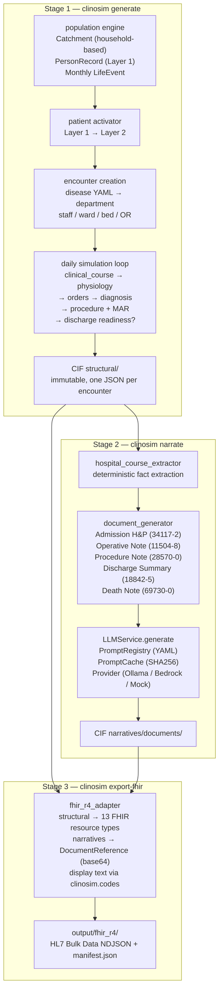
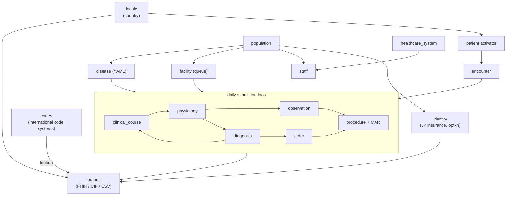

# clinosim

> **Clinically Realistic Hospital Data Simulator** — Generate FHIR R4 EHR data from a virtual hospital

[](https://www.python.org/)
[](LICENSE)
[](https://hl7.org/fhir/uv/bulkdata/)
[]()

🇯🇵 **日本語版**: [README.ja.md](README.ja.md)

**clinosim** generates synthetic EHR data through **forward simulation** starting from a population. Rather than producing random values, every patient carries a hidden **9-variable physiological state**, and all observations (labs, vitals, medications, diagnoses) are derived from that state — ensuring **clinically coherent** data.

Primary use cases:
- Training data for medical AI/ML models
- EHR system testing and QA
- Clinical research simulation
- Educational case datasets

---

## Table of Contents

- [Features](#features)
- [Installation](#installation)
- [Quick Start](#quick-start)
- [CLI Reference](#cli-reference)
- [Output Formats](#output-formats)
- [Data Flow](#data-flow)
- [Module Architecture](#module-architecture)
- [Code Systems & Authoritative Sources](#code-systems--authoritative-sources)
- [Supported Diseases](#supported-diseases)
- [Multi-Country Support](#multi-country-support)
- [Hospital Configuration](#hospital-configuration)
- [Design Philosophy](#design-philosophy)
- [Testing](#testing)
- [Extension Guide](#extension-guide)
- [License](#license)

---

## Features

- **HL7 FHIR Bulk Data Access** compliant NDJSON output (Patient.ndjson, Encounter.ndjson, ...)
- **Three-stage pipeline**: `generate` (structured CIF) → `narrate` (LLM clinical documents) → `export-fhir` (FHIR R4 NDJSON). Each stage is re-runnable and independently testable.
- **Clinical documents as FHIR DocumentReference** (LOINC-coded): Discharge Summary, Death Note, Operative Note, Admission H&P, Procedure Note — each base64-encoded and linked to Patient/Encounter/Procedure
- **Pluggable LLM providers** (Ollama, AWS Bedrock, Mock) with YAML-driven factory and SHA256 disk cache for reproducibility and cost control
- **9-variable physiology model** ensures labs/vitals are physiologically and clinically coherent
- **Bayesian differential diagnosis** with likelihood ratios; 6 disease trajectory archetypes
- **Authoritative code systems** (ICD-10-CM, LOINC, RxNorm, JLAC10, YJ codes, CPT, SNOMED CT subset) with multilingual display
- **32 diseases + 46 ED/outpatient conditions** defined in YAML (no code changes to add new ones)
- **JCCLS reference ranges 2022** for Japanese labs; Tietz/Mayo for US
- **NEWS2-compatible vitals** including AVPU consciousness level and supplemental oxygen
- **Microbiology cultures + antibiotic susceptibility** for bacterial infections (sepsis, pneumonia, UTI, cellulitis): organism identification (SNOMED) and S/I/R antibiograms — emitted as FHIR `DiagnosticReport` + `Specimen` + `Observation`. All codes data-driven (`observation/reference_data/microbiology.yaml`)
- **Ward + bed Location hierarchy** with PractitionerRole.location assignment
- **Operating rooms** modeled as FHIR Locations; surgical procedures include category (SNOMED), performer.function (surgeon/anaesthetist), bodySite, outcome, and complications
- **Occupational injuries**: 6 work-related conditions (crush injury, industrial burn, fall from height, electrical injury, eye foreign body, chemical exposure) with occupation-based risk multipliers
- **Patient occupation** field (12 categories) with FHIR Observation (LOINC 11341-5, social-history)
- **Japanese insurance enrollment** (opt-in, `--jp-insurance`): occupation-driven 社保/国保/後期高齢者, valid 保険者番号/被保険者番号 check digits, マイナンバーカード・マイナ保険証 status — emitted as JP Core FHIR `Coverage` + 保険者 `Organization`. 個人番号 stays internal (never exported).
- **Multilingual FHIR coding**: Condition and Procedure emit dual coding entries (primary language + interop language); Condition code.text includes clinical abbreviations (COPD, CHF, CKD, DM)
- **Snapshot date** support — includes "currently admitted" patients (in-progress encounters)
- **30-day readmission chains** with `prior_encounter_id` linking
- **Multi-country**: US (English) and JP (Japanese) parallel output
- **Fully deterministic** with seed
- **English-first with language fallback** in code systems and LLM prompt templates

---

## Installation

```bash
git clone https://github.com/TomoOkuyama/clinosim.git
cd clinosim
python -m venv .venv
source .venv/bin/activate          # Windows: .venv\Scripts\activate
pip install -e ".[dev]"
```

**Requirements**:
- Python 3.11+
- Main dependencies: numpy, pyyaml, pydantic
- (Optional) Ollama for local LLM narrative generation

---

## Quick Start

### CLI

```bash
# === Stage 1: structured simulation (always local, deterministic) ===

# Default: US, past 1 year ending today, 40,000 catchment, 50-bed hospital
clinosim generate -o ./output

# Custom period (--end is the snapshot date)
clinosim generate -o ./output --start 2024-01-01 --end 2024-12-31

# Japan 10-bed clinic
clinosim generate -o ./output \
  --country JP \
  --hospital-config clinosim/config/hospital_small.yaml \
  -p 12000

# === Stage 2: clinical documents (optional — requires CIF from Stage 1) ===

# Template mode (no LLM, deterministic, instant sanity check)
clinosim narrate --cif-dir ./output/cif --version-id template_v1

# Local Ollama
clinosim narrate --cif-dir ./output/cif \
  --llm-config clinosim/config/llm_service.yaml \
  --version-id ollama_en_v1

# Japanese documents via AWS Bedrock (requires EC2 + Bedrock access)
clinosim narrate --cif-dir ./output/cif \
  --llm-config clinosim/config/llm_service.bedrock.yaml \
  --language ja \
  --version-id bedrock_ja_v1

# Only a subset of document types
clinosim narrate --cif-dir ./output/cif \
  --tasks discharge_summary,operative_note

# === Stage 3: FHIR Bulk Data export ===

# Without documents (backward compatible)
clinosim export-fhir --cif-dir ./output/cif

# With a specific narrative version → adds DocumentReference.ndjson
clinosim export-fhir --cif-dir ./output/cif --narrative-version ollama_en_v1

# === One-shot pipeline ===

# Stage 1 + Stage 2 + Stage 3 in a single command
clinosim generate -o ./output --format fhir --narrative \
  --llm-config clinosim/config/llm_service.yaml

# === Debug / inspection ===

# Forced disease scenario (debugging)
clinosim test-disease bacterial_pneumonia -n 5 --severity moderate

# Encounter unit test
clinosim test-encounter chest_pain_noncardiac --age 65 --sex M

# List available diseases and encounters
clinosim list-diseases
```

### Python API

```python
from clinosim.simulator import run_beta
from clinosim.types.config import SimulatorConfig

config = SimulatorConfig(
    catchment_population=40_000,
    country="US",
    random_seed=42,
    snapshot_date="2026-04-08",   # EHR snapshot at this point in time
)
dataset = run_beta(config)

# Access results
for record in dataset.patients:
    enc = record.encounters[0]
    print(f"{record.patient.name.family_name}: {enc.encounter_type} → {enc.status}")
    print(f"  labs={len(record.lab_results)}, vitals={len(record.vital_signs)}")
```

### Code System Lookup

```python
from clinosim.codes import lookup, get_system_uri

lookup("icd-10-cm", "N10", "en")
# → "Acute tubulo-interstitial nephritis"

lookup("icd-10-cm", "N10", "ja")
# → "急性腎盂腎炎"

get_system_uri("loinc")
# → "http://loinc.org"
```

---

## CLI Reference

clinosim is organized as three independent stages. You can run them as a single pipeline with `clinosim generate`, or run each stage separately for reproducibility, remote execution (e.g. Bedrock on EC2), or iterative narrative experiments.

```
┌────────────────┐  ┌────────────────┐  ┌──────────────────┐
│ generate       │→ │ narrate        │→ │ export-fhir      │
│ (Stage 1)      │  │ (Stage 2)      │  │ (Stage 3)        │
│ structured CIF │  │ narrative CIF  │  │ FHIR R4 NDJSON   │
└────────────────┘  └────────────────┘  └──────────────────┘
```

### `clinosim generate` — Stage 1 (structural simulation)

Population-driven simulation. Produces the structural CIF and optionally runs Stage 2/3 in one command.

| Option | Default | Description |
|---|---|---|
| `-o, --output DIR` | `./output` | Output directory |
| `-p, --population N` | hospital config's `recommended_population` | Catchment population |
| `--country CODE` | `US` | `US` or `JP` |
| `--start YYYY-MM-DD` | `--end` minus 1 year | Simulation start date |
| `--end YYYY-MM-DD` | today | Simulation end date = snapshot date |
| `--hospital-config PATH` | `clinosim/config/hospital_operations.yaml` (50-bed) | Hospital config YAML |
| `--format ...` | `cif fhir` | `cif`, `csv`, `fhir` |
| `-s, --seed N` | `42` | Random seed |
| `--narrative` | off | Run Stage 2 (clinical documents) after Stage 1 |
| `--llm-config PATH` | (unset) | LLM service YAML used when `--narrative` is set |
| `--narrative-version ID` | auto | Narrative version id used when exporting FHIR |
| `--narrative-model NAME` | `qwen:7b` | Legacy Ollama model name (ignored if `--llm-config` is set) |

### `clinosim narrate` — Stage 2 (clinical documents)

Reads an existing CIF directory and generates clinical documents via the LLM service. Writes a new narrative version to `<cif>/narratives/<version_id>/`.

| Option | Default | Description |
|---|---|---|
| `--cif-dir DIR` | **required** | Path to an existing CIF directory |
| `--llm-config PATH` | (template mode) | LLM service YAML (`clinosim/config/llm_service*.yaml`) |
| `--version-id ID` | auto-timestamped | Narrative version directory name |
| `--language LANG` | `en` | Document language (`en` \| `ja`) |
| `--tasks LIST` | all Tier A+B | Comma-separated subset: `discharge_summary,death_summary,operative_note,admission_hp,procedure_note` |

**Tier A+B document scope** (default):

| Document | LOINC | Generated when | Frequency |
|---|---|---|---|
| Discharge Summary | `18842-5` | Every inpatient discharge | 1 per encounter |
| Death Note | `69730-0` | Deceased inpatient | 1 per death |
| Operative Note | `11504-8` | Surgical procedure (SNOMED 387713003) | 1 per surgery |
| Admission H&P | `34117-2` | Every inpatient admission | 1 per encounter |
| Procedure Note | `28570-0` | Invasive bedside (central line, LP, thoracentesis, paracentesis, chest tube, intubation, bronchoscopy, cardioversion) | 1 per procedure |

See [docs/clinical_documents.md](docs/clinical_documents.md) for details.

### `clinosim export-fhir` — Stage 3 (FHIR R4 NDJSON)

Reads an existing CIF directory (optionally with a narrative version) and writes FHIR R4 Bulk Data NDJSON files.

| Option | Default | Description |
|---|---|---|
| `--cif-dir DIR` | **required** | Path to an existing CIF directory |
| `-o, --output DIR` | `<cif>/../fhir_r4` | Output directory |
| `--country CODE` | `US` | Country code (display language) |
| `--narrative-version ID` | (none) | Narrative version to include as `DocumentReference.ndjson`. Use `current` to read the pointer at `<cif>/narratives/current_version.txt` |

### `clinosim test-disease DISEASE_ID`

Generate forced scenario for a specific disease (debugging / golden tests).

```bash
clinosim test-disease heart_failure_exacerbation \
  --severity severe --archetype treatment_resistant -n 3
```

### `clinosim test-encounter CONDITION_ID`

ED / outpatient encounter unit test.

```bash
clinosim test-encounter migraine --age 35 --sex F
```

### `clinosim validate`

Quality check generated data against published benchmarks.

### `clinosim list-diseases`

Show all 32 diseases + 46 encounter conditions.

### Typical workflows

**Local template-only run (no LLM, deterministic):**
```bash
clinosim generate -o ./output -p 5000 --country US
clinosim narrate --cif-dir ./output/cif --version-id template_v1
clinosim export-fhir --cif-dir ./output/cif --narrative-version template_v1
```

**Local LLM (Ollama):**
```bash
clinosim generate -o ./output -p 5000 --country US
clinosim narrate --cif-dir ./output/cif \
    --llm-config clinosim/config/llm_service.yaml \
    --version-id ollama_en_v1
clinosim export-fhir --cif-dir ./output/cif --narrative-version ollama_en_v1
```

**Split: local Stage 1, EC2 Stage 2 (Bedrock), back to local Stage 3:**
```bash
# On local machine
clinosim generate -o ./output -p 5000 --country US --format cif
scp -r ./output/cif ec2-user@ec2-host:/home/ec2-user/

# On EC2 (IAM role with bedrock:Converse)
clinosim narrate --cif-dir /home/ec2-user/cif \
    --llm-config clinosim/config/llm_service.bedrock.yaml \
    --version-id bedrock_sonnet_en_v1

# Pull result back, then
clinosim export-fhir --cif-dir ./output/cif \
    --narrative-version bedrock_sonnet_en_v1
```

See [docs/bedrock_setup.md](docs/bedrock_setup.md) for the EC2 + Bedrock setup guide.

---

## Output Formats

### CIF (Clinosim Intermediate Format)

```
output/cif/
├── metadata.json                             # Generation info, snapshot_date, etc.
├── hospital.json                             # Staff roster + hospital config
├── structural/                               # Stage 1 output (immutable)
│   └── patients/
│       └── ENC-POP-XXXXXX-NNNNNN.json        # One file per encounter
└── narratives/                               # Stage 2 output (re-runnable)
    ├── current_version.txt                   # Pointer to the latest version id
    ├── <version_id>/
    │   ├── manifest.json                     # LLM config, model, cost report, counts
    │   └── documents/
    │       └── ENC-POP-XXXXXX-NNNNNN/
    │           ├── admission_hp.json
    │           ├── discharge_summary.json
    │           ├── death_summary.json        # only if deceased
    │           ├── operative_note_001.json   # per surgery
    │           └── procedure_note_<type>.json
    └── <another_version_id>/                 # multiple versions coexist
        └── ...
```

- `structural/` is the **immutable intermediate format** of the simulation. All structural FHIR/CSV resources derive from this.
- `narratives/<version>/documents/` is the **narrative layer** — one JSON per clinical document, conforming to the `ClinicalDocument` type in `clinosim/types/clinical.py`. Each file contains the LOINC code, plain-text content, references, and provenance (LLM model, tokens, cache hit, prompt version, generated_at).
- Multiple narrative versions can coexist: e.g. `template_v1`, `ollama_en_v1`, `bedrock_sonnet_en_v1` — all generated from the same structural CIF.

### FHIR R4 — Bulk Data Export NDJSON Format

Compliant with [HL7 FHIR Bulk Data Access](https://hl7.org/fhir/uv/bulkdata/):

```
output/fhir_r4/
├── manifest.json                    # Bulk Data manifest (transactionTime, output[])
├── Patient.ndjson                   # 1 patient per line
├── Encounter.ndjson                 # 1 encounter per line
├── Observation.ndjson               # labs + vitals + AVPU + O2 + microbiology (LOINC/SNOMED)
├── DiagnosticReport.ndjson          # Microbiology culture reports (infections; + Specimen)
├── Specimen.ndjson                  # Culture specimens (blood/urine/sputum/wound)
├── Condition.ndjson                 # Encounter dx + chronic conditions (ICD-10-CM / ICD-10)
├── MedicationRequest.ndjson         # Prescriptions (RxNorm / YJ)
├── MedicationAdministration.ndjson  # MAR records
├── Procedure.ndjson                 # Surgery + bedside procedures (CPT / K-code + SNOMED CT metadata)
├── DocumentReference.ndjson         # Clinical documents (only when a narrative version is provided)
├── AllergyIntolerance.ndjson        # Patient-level (deduplicated)
├── Coverage.ndjson                  # Insurance enrollment (JP only; JP Core 被保険者番号/記号/番号/枝番)
├── Practitioner.ndjson              # Doctors, nurses, technicians
├── PractitionerRole.ndjson          # Specialty + organization + ward location
├── Organization.ndjson              # Hospital + departments + insurers (保険者, JP)
└── Location.ndjson                  # Wards + beds + operating rooms
```

Each line = 1 FHIR resource. `Resource.id` is unique across all resource types. Reference integrity is maintained.

`DocumentReference.ndjson` is emitted only when `clinosim export-fhir` is given `--narrative-version` (or when `clinosim generate --narrative --format fhir` runs the full pipeline). Without a narrative version, the remaining resource types are produced normally. `Coverage.ndjson` (+ insurer `Organization`) is emitted only for JP with insurance enabled (`--jp-insurance`, default on).

### Included FHIR R4 Fields (key resources)

| Resource | Fields |
|---|---|
| Patient | identifier (MRN, type=MR), name (with kanji+kana extension for JP), gender, birthDate, address, telecom, maritalStatus, communication (BCP-47), contact (emergency) |
| Encounter | class, type (SNOMED), serviceType, priority, period, length, participant (ATND/ADM/DIS), diagnosis ref, hospitalization (admitSource, dischargeDisposition), location (bed → ward via partOf), serviceProvider (department Org) |
| Observation | code (LOINC), valueQuantity (UCUM units + system + code), referenceRange (low/high/text/source extension for JP Core), interpretation (N/H/L/HH/LL), encounter, performer |
| Condition | code (ICD-10-CM with display), category (encounter-diagnosis / problem-list-item), severity (SNOMED), stage (NYHA, CKD G, GOLD, etc.), clinicalStatus (active/resolved), onsetDateTime, recordedDate, encounter |
| MedicationRequest | medicationCodeableConcept (RxNorm), dosageInstruction (text + doseAndRate + timing repeat + route SNOMED), encounter, requester, reasonReference |
| MedicationAdministration | dosage (dose SimpleQuantity + route + rateQuantity for continuous), context, performer, reasonReference |
| Procedure | code (CPT / K-code), category (SNOMED: surgical/diagnostic/therapeutic), encounter, performedPeriod, performer[] with function (surgeon/anaesthetist), recorder, reasonReference, bodySite (SNOMED), location (operating room), outcome (SNOMED), complication (SNOMED) |
| DocumentReference | type (LOINC: 18842-5 / 69730-0 / 11504-8 / 34117-2 / 28570-0), category (clinical-note), subject, date, author, content.attachment (base64 text/plain, size, sha1 hash), context (encounter period, related Procedure) |
| Practitioner | name (with prefix), gender, telecom, qualification |
| PractitionerRole | practitioner, organization (dept), location (ward), specialty (SNOMED) |
| Location | physicalType (wa=ward, bd=bed, area, ro=operating room), partOf (bed→ward), managingOrganization |
| Organization | hospital-main + dept-{specialty} (partOf hierarchy) |

### CSV

```
output/csv/
├── patients.csv
├── encounters.csv
├── conditions.csv
├── lab_results.csv
├── vital_signs.csv
├── orders.csv
├── medication_administrations.csv
├── procedures.csv
└── ...
```

---

## Data Flow

clinosim implements a three-stage pipeline. Each stage is self-contained, has a well-defined input and output on disk, and can be run independently of the others.



**Why three stages?**

- **Reproducibility** — Stage 1 is fully deterministic from a seed. Stage 2 is cached by SHA256(prompt). Stage 3 is a pure function of CIF.
- **Cost control** — Stage 2 is the only stage that may call a paid LLM API. Bedrock runs can be isolated to a single EC2 invocation.
- **Experimentation** — Multiple narrative versions (different models, different prompt versions) can be generated from the same structural CIF and compared.
- **Remote execution** — Stage 2 can be run on a machine with network access to the LLM (e.g. EC2 for Bedrock), while Stage 1 and Stage 3 stay local.

### Snapshot Semantics

- Simulation period: `--start` ~ `--end`
- `--end` = **snapshot date**
- No life events generated past the snapshot date (no future admissions)
- Inpatients whose `discharge_datetime` would fall after the snapshot date:
  - `discharge_datetime = None`
  - `Encounter.status = "in-progress"`
  - Partial data only (labs/vitals/orders/MAR up to snapshot day)
  - Primary `Condition.clinicalStatus = "active"` (not resolved)
- This produces a realistic EHR snapshot **including currently admitted patients** (e.g., 50-bed × 60% occupancy ≈ 30 in-progress encounters)

---

## Module Architecture

```
clinosim/
├── codes/                    # ★ International code systems + multilingual display (locale-independent)
│   ├── data/
│   │   ├── icd-10-cm.yaml    # 234 codes
│   │   ├── icd-10.yaml       # 133 (WHO ICD-10, JP)
│   │   ├── loinc.yaml        # 65
│   │   ├── jlac10.yaml       # 30
│   │   ├── rxnorm.yaml       # 68
│   │   ├── yj.yaml           # 39
│   │   ├── cpt.yaml          # 31
│   │   ├── k-codes.yaml      # 25
│   │   └── snomed-ct.yaml    # 31 (subset: procedure structural fields)
│   └── loader.py             # lookup(system, code, lang) API
│
├── locale/                   # Country/culture-specific data
│   ├── jp/, us/
│   │   ├── names.yaml        # Person names (family + given + reading)
│   │   ├── addresses.yaml    # 47 prefectures / 50 states + ZIP
│   │   ├── demographics.yaml # Age dist, incidence rates
│   │   ├── formatting.yaml   # Date/unit formatting
│   │   ├── reference_range_lab.yaml  # JCCLS / Tietz reference ranges
│   │   └── code_mapping_*.yaml  # Internal test name → standard code
│   └── shared/
│       ├── chronic_followup.yaml      # Outpatient patterns by chronic dx
│       ├── chronic_medications.yaml   # Home meds + monitoring
│       └── naming_rules.yaml          # Name generation rules
│
├── config/                   # Hospital configuration YAMLs
│   ├── hospital_operations.yaml  # 50-bed community hospital (default)
│   ├── hospital_small.yaml       # 10-bed clinic
│   ├── hospital_large.yaml       # large hospital
│   ├── llm_service.yaml          # LLM (local Ollama default)
│   └── llm_service.cloud.yaml    # Anthropic API
│
├── types/                    # Data type definitions (Pydantic / dataclass)
│   ├── config.py             # SimulatorConfig
│   ├── patient.py            # PatientProfile, ChronicCondition
│   ├── clinical.py           # PhysiologicalState, ClinicalDiagnosis
│   ├── encounter.py          # Encounter, Order, VitalSignRecord, MAR
│   ├── identity.py           # NationalIdentity, InsuranceEnrollment, IdentityTimeline
│   └── output.py             # CIFDataset, CIFPatientRecord, CIFMetadata
│
├── modules/                  # Functional modules (each with README)
│   ├── disease/              # 32 disease YAML protocols
│   ├── encounter/            # 46 ED/outpatient condition YAMLs
│   ├── physiology/           # 9-state model + lab/vital derivation
│   ├── clinical_course/      # 6 archetypes + complications + diagnosis feedback
│   ├── diagnosis/            # Bayesian differential (LR table)
│   ├── observation/          # 3-layer lab noise + flagging
│   ├── order/                # Lab/medication/imaging orders + result delays
│   ├── procedure/            # Surgery + bedside procedures + rehabilitation
│   ├── population/           # Population/household generation + life events
│   ├── patient/              # Layer1 → Layer2 activator
│   ├── staff/                # Hospital staff roster + assignment
│   ├── facility/             # Hospital state + M/M/1 queueing
│   ├── healthcare_system/    # Country-specific parameters (JP / US)
│   ├── identity/             # Resident identifier & insurance numbering (JP, opt-in)
│   ├── output/               # CIF / FHIR R4 / CSV + clinical documents
│   │   ├── cif_writer.py              # CIF structural writer
│   │   ├── fhir_r4_adapter.py         # FHIR R4 Bulk NDJSON (incl. DocumentReference)
│   │   ├── csv_adapter.py             # CSV tables
│   │   ├── document_generator.py      # ★ Stage 2: narrative CIF writer
│   │   └── hospital_course_extractor.py  # ★ deterministic event extraction
│   ├── llm_service/          # All LLM access (AD-11)
│   │   ├── engine.py                  # LLMService, LLMTaskType, PatientSummary
│   │   ├── factory.py                 # YAML → LLMService
│   │   ├── prompt_registry.py         # ★ YAML-based prompt templates
│   │   ├── cache.py                   # ★ SHA256 disk cache
│   │   ├── providers/                 # ★ Pluggable provider subpackage
│   │   │   ├── base.py                # LLMProvider Protocol + ProviderResponse
│   │   │   ├── ollama.py              # Local Ollama
│   │   │   ├── bedrock.py             # AWS Bedrock (boto3 lazy import)
│   │   │   └── mock.py                # Deterministic test provider
│   │   └── prompts/                   # ★ Prompt template YAML tree
│   │       └── en/                    # English prompts (5 Tier A+B types)
│   │           ├── admission_hp.yaml
│   │           ├── discharge_summary.yaml
│   │           ├── death_summary.yaml
│   │           ├── operative_note.yaml
│   │           └── procedure_note.yaml
│   └── validator/            # Comparison against published benchmarks
│
├── simulator/                # Top-level orchestration
│   ├── engine.py             # run_beta, run_forced
│   ├── inpatient.py          # Inpatient simulation
│   ├── emergency.py          # ED visit
│   ├── outpatient.py         # Outpatient visit
│   ├── helpers.py            # Ward/department resolver, mortality, etc.
│   └── cli.py                # CLI entry point (generate, narrate, export-fhir, ...)
│
└── tests/
    ├── unit/                 # Module unit tests (234 tests total across suites)
    ├── integration/          # Cross-module integration tests
    └── e2e/                  # E2E + golden file tests
```

Each module has its own **README.md** documenting purpose, design principles, API, data structures, and extension procedures.

---

## Code Systems & Authoritative Sources

`clinosim/codes/` centralizes international standard code systems, all with English display (Japanese is optional).

| Key | Name | Use | Authoritative Source |
|---|---|---|---|
| `icd-10-cm` | ICD-10-CM | US diagnoses | [CMS](https://www.cms.gov/medicare/coding-billing/icd-10-codes) |
| `icd-10` | WHO ICD-10 | JP diagnoses | [WHO](https://icd.who.int/browse10/) |
| `loinc` | LOINC | Lab tests, vitals, clinical document types | [Regenstrief](https://loinc.org/) |
| `snomed-ct` | SNOMED CT (subset) | Procedure category, performer role, body site, outcome, complication | [SNOMED International](https://www.snomed.org/) |
| `jlac10` | JLAC10 | JP lab codes | [JCCLS](https://www.jccls.org/) |
| `rxnorm` | RxNorm | US drugs | [NLM](https://www.nlm.nih.gov/research/umls/rxnorm/) |
| `yj` | YJ codes | JP drugs | MHLW Drug Price Standards |
| `cpt` | CPT | US procedures | [AMA](https://www.ama-assn.org/practice-management/cpt) |
| `k-codes` | K codes | JP reimbursement procedures | MHLW Medical Fee Schedule |

Clinical document types use the following LOINC codes:

| Document | LOINC | Notes |
|---|---|---|
| History and physical note | `34117-2` | Generated at admission |
| Progress note | `11506-3` | Reserved for future Tier C scope |
| Discharge summary note | `18842-5` | Generated at discharge |
| Death note | `69730-0` | Generated when `deceased=true` |
| Surgical operation note | `11504-8` | Generated per surgical procedure |
| Procedure note | `28570-0` | Generated per invasive bedside procedure |

### Using Code Systems (FHIR Observation example)

```python
from clinosim.codes import lookup, get_system_uri

# CIF data is code-only
crp_code = "1988-5"  # LOINC

# Build FHIR Observation
obs = {
    "resourceType": "Observation",
    "code": {
        "coding": [{
            "system": get_system_uri("loinc"),
            "code": crp_code,
            "display": lookup("loinc", crp_code, "en"),
        }],
    },
    "valueQuantity": {"value": 38.2, "unit": "mg/L"},
}
```

See `clinosim/codes/README.md` for details.

---

## Supported Diseases

32 diseases defined in YAML, covering ~80% of acute hospital admissions:

| Category | Diseases |
|---|---|
| **Respiratory** | Bacterial pneumonia, Aspiration pneumonia, COPD exacerbation, Asthma exacerbation, Influenza, Pulmonary embolism |
| **Cardiovascular** | Heart failure exacerbation, Acute MI, Atrial fibrillation/RVR |
| **Neurological** | Cerebral infarction, Hemorrhagic stroke, Subdural hematoma |
| **GI/Hepatic** | GI bleeding, Acute pancreatitis, Ileus, Decompensated cirrhosis |
| **General Surgery** | Acute appendicitis, Acute cholecystitis |
| **Orthopedic** | Hip fracture, Vertebral compression fracture, Wrist fracture |
| **Trauma** | Severe traffic accident |
| **Metabolic** | Diabetic ketoacidosis |
| **Renal** | Acute kidney injury |
| **Infectious** | Sepsis, Urinary tract infection, Cellulitis |
| **Vascular** | Deep vein thrombosis |
| **Occupational (労災)** | Crush injury (hand), Severe industrial burn, Fall from height, Electrical injury |

Plus **46 ED/outpatient conditions** (chest pain, viral gastroenteritis, ankle sprain, annual screening, flu vaccination, dialysis session, etc.) — see `clinosim/modules/encounter/reference_data/`.

Adding new diseases requires **only adding a YAML file** (no code changes). See `clinosim/modules/disease/README.md`.

---

## Multi-Country Support

| Item | US (default) | JP (`--country JP`) |
|---|---|---|
| Diagnosis codes | ICD-10-CM | ICD-10 (WHO) |
| Lab codes | LOINC | JLAC10 |
| Drug codes | RxNorm | YJ codes |
| Procedure codes | CPT | K codes |
| Display language | English | Japanese (English fallback) |
| Patient names | English | Kanji + kana extension |
| Addresses | 50 US states | 47 Japanese prefectures (JIS X 0401) |
| Lab reference ranges | Tietz/Mayo | JCCLS Reference Intervals 2022 |
| Marital status | HL7 v3 (S/M/D/W) | Same |
| Language | en-US | ja-JP |

---

## Hospital Configuration

`clinosim/config/hospital_*.yaml` defines hospital physical layout and operational parameters:

```yaml
recommended_population: 60000

available_departments:           # Available specialties
  - internal_medicine
  - cardiology
  - gastroenterology
  - general_surgery
  - orthopedics
  - emergency_medicine
  - primary_care

department_rollup:              # Sub-specialty → available department
  pulmonology: internal_medicine
  neurology: internal_medicine
  neurosurgery: general_surgery

wards:                          # Wards per department
  internal_medicine: ["4E", "4W"]
  cardiology: ["5E"]
  general_surgery: ["3E"]
  orthopedics: ["3W"]
  emergency_medicine: ["ER"]
  primary_care: ["OPD"]

ward_capacity:                  # Bed count per ward
  "4E": 10
  "4W": 10
  "5E": 8
  "3E": 8
  "3W": 6

resource_capacity:              # Lab/imaging capacity
  lab_analyzers: 2
  ct_scanners: 1
  mri_scanners: 0
  inpatient_beds: 50

staffing:                       # Staffing ratio per shift
  day:    {hours: [8, 16],  lab_staff: 1.0, nursing_staff: 1.0}
  evening:{hours: [16, 0],  lab_staff: 0.5, nursing_staff: 0.7}
  night:  {hours: [0, 8],   lab_staff: 0.2, nursing_staff: 0.5}
```

This enables:
- Automatic disease → department → ward → bed routing
- M/M/1 queueing model with dynamic test result delays
- Nurses assigned per ward (PractitionerRole.location)
- Switchable hospital templates (large / mid-size / clinic)

See `clinosim/modules/facility/README.md`.

---

## Design Philosophy

1. **State before observation** — Lab values are never generated independently. All observations derive from physiological state.
2. **Process before outcome** — Diagnoses emerge from Bayesian reasoning over test results. Treatment changes are tied to observable clinical triggers.
3. **Institution shapes behavior** — The same disease produces different data depending on healthcare system (insurance, discharge criteria, culture).
4. **Code is the truth** — CIF stores only codes; display text is resolved at output time via the codes module.
5. **YAML-driven extensibility** — Adding a disease = adding a YAML file. No engine code changes.
6. **English-first** — All codes must have English display; other languages are translation attributes.
7. **Authoritative sources** — Code values and English text follow official definitions from CMS/NLM/AMA/WHO/etc.
8. **Single source of truth** — No duplicate data (e.g., CIF doesn't store display, codes module is the only source).

---

## Testing

```bash
source .venv/bin/activate

# All tests (234 tests; unit+integration ~2 min, e2e golden ~8 min)
pytest -x

# By category
pytest -m unit                   # Unit tests
pytest -m integration            # Cross-module
pytest -m e2e                    # E2E + golden tests

# Coverage
pytest --cov=clinosim
```

---

## Extension Guide

### Add a new disease

1. Create `clinosim/modules/disease/reference_data/<disease_id>.yaml` (use existing disease as template)
2. Add to incidence list in `clinosim/locale/<country>/demographics.yaml`
3. Add necessary ICD codes to `clinosim/codes/data/icd-10-cm.yaml` (if not present)
4. Test: `clinosim test-disease <disease_id>`

Details: `clinosim/modules/disease/README.md`

### Add a new encounter type (ED/outpatient)

1. Create `clinosim/modules/encounter/reference_data/<condition_id>.yaml`
2. Include `icd10_code` and `icd10_display`
3. Test: `clinosim test-encounter <condition_id>`

### Add a new country

1. Create `clinosim/locale/<country_code>/` folder
2. Add `names.yaml`, `addresses.yaml`, `demographics.yaml`, `reference_range_lab.yaml`, `formatting.yaml`
3. Add entry in `clinosim/locale/shared/naming_rules.yaml`
4. (Optional) Add country-specific code system to `codes/data/`

### Add a new language

Add a new language key to each entry in `clinosim/codes/data/*.yaml`:

```yaml
N10:
  en: "Acute tubulo-interstitial nephritis"
  ja: "急性腎盂腎炎"
  de: "Akute tubulointerstitielle Nephritis"   # New language
```

Details: `clinosim/codes/README.md`

---

## Module Dependency Graph



`llm_service` and `validator` are cross-cutting (used in dedicated phases).
`identity` is an opt-in enricher (AD-54): it runs as a post-population pass via the
enricher registry (AD-56) and its data is emitted as FHIR `Coverage` by `output`.

See each module's `clinosim/modules/<module>/README.md` for details.

---

## LLM Integration (Optional)

clinosim uses LLMs only for **clinical documents** (Stage 2). All structural data (labs, vitals, diagnoses, meds) is deterministic and does not require an LLM.

### Architecture

- Single entry point: `clinosim.modules.llm_service.LLMService` (AD-11). No other module may call an LLM SDK directly.
- Two task categories (AD-13, AD-24):
  - **JUDGMENT** — clinical reasoning, always English, structured output (reserved for future use).
  - **NARRATIVE** — clinical documents, target language, free text.
- Pluggable providers via `clinosim.modules.llm_service.providers`:
  - `ollama` — local Ollama server (default)
  - `bedrock` — AWS Bedrock via Converse API (for EC2 deployment)
  - `mock` — deterministic stub for tests
  - New providers can be registered via `providers.register_provider()`.
- Prompt templates live as YAML under `clinosim/modules/llm_service/prompts/<lang>/<task>.yaml` and are rendered with `string.Template`.
- All responses are cached by SHA256(system + user + model) on disk for reproducibility and cost control.

### Local Ollama (default)

```bash
brew install ollama
ollama serve
ollama pull llama3.1:8b

clinosim narrate --cif-dir ./output/cif \
  --llm-config clinosim/config/llm_service.yaml \
  --version-id ollama_en_v1
```

### AWS Bedrock (EC2)

```bash
pip install 'clinosim[bedrock]'   # installs boto3

# On an EC2 instance with an IAM role that grants bedrock:Converse:
clinosim narrate --cif-dir ./cif \
  --llm-config clinosim/config/llm_service.bedrock.yaml \
  --version-id bedrock_sonnet_en_v1
```

See [docs/bedrock_setup.md](docs/bedrock_setup.md) for full EC2 + IAM setup.

### Template mode (no LLM)

```bash
clinosim narrate --cif-dir ./output/cif --version-id template_v1
```

Template mode runs Stage 2 without any network call and produces deterministic placeholder content. Useful for CI, reproducibility tests, and sanity checks.

### Extending to new providers

```python
from clinosim.modules.llm_service.providers import register_provider

class MyProvider:
    def __init__(self, config): ...
    def complete(self, prompt, model, max_tokens, system_prompt, **kwargs): ...
    def health_check(self): return True

register_provider("my_provider", lambda cfg: MyProvider(cfg))
```

Then reference `provider: my_provider` in your `llm_service.yaml`.

Details: [docs/clinical_documents.md](docs/clinical_documents.md), `clinosim/modules/llm_service/README.md`

---

## Data Quality Validation

```bash
# Compare against published benchmarks (LOS, mortality, complication rates)
clinosim validate -p 5000 --country US
```

Public sources:
- JAMA, NEJM clinical guidelines
- AHRQ Healthcare Cost and Utilization Project (HCUP)
- MHLW Patient Survey (Japan)
- OECD Health Data

Details: `clinosim/modules/validator/README.md`

---

## Disclaimer

clinosim generates entirely **synthetic** data. No real patient information is used or produced. Generated data is intended for software development, algorithm research, and system testing only. **It must not be used for clinical decision-making**.

---

## Contributing

Contributions are welcome, especially from clinicians who can review the realism of disease modules and physiological mappings.

```bash
git clone https://github.com/TomoOkuyama/clinosim.git
cd clinosim
python -m venv .venv
source .venv/bin/activate
pip install -e ".[dev]"
pytest
```

Each module's README has extension guidelines.

---

## License

MIT License. See [LICENSE](LICENSE) for details.

Code system data follows the original registry's license:
- ICD-10-CM, RxNorm: Public domain
- LOINC: LOINC License (free for commercial use)
- WHO ICD-10: WHO Terms of Use
- CPT: AMA Copyright (educational/research subset only)
- JLAC10, YJ, K-codes: MHLW / JCCLS public data

---

## Citation

```bibtex
@software{clinosim,
  title  = {clinosim: Clinically Realistic Hospital Data Simulator},
  year   = {2026},
  url    = {https://github.com/TomoOkuyama/clinosim}
}
```

---

## Related Documentation

- [README.ja.md](README.ja.md) — 日本語版 README
- [DESIGN.md](DESIGN.md) — Detailed design document (architecture decisions, ADRs)
- [TODO.md](TODO.md) — Development roadmap
- [CLAUDE.md](CLAUDE.md) — Claude Code development guidelines
- [docs/clinical_documents.md](docs/clinical_documents.md) — Clinical document generation guide (LOINC mapping, prompts, extending to new types)
- [docs/bedrock_setup.md](docs/bedrock_setup.md) — EC2 + AWS Bedrock setup for Stage 2 at scale
- Each module's `README.md` — Module-level API reference
