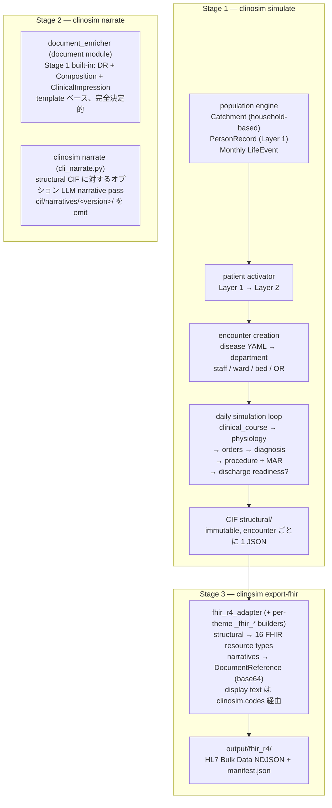

<!-- README.md から抽出 (Issue #568 PR A2)。本ファイルの見出しが変更されたら README のポインタを更新。 -->

# データフロー

clinosim は 3 ステージパイプラインを実装。各ステージは自己完結し、
ディスク上に明確に定義された入出力を持ち、他と独立に実行可能。

**なぜ 3 ステージか?**

- **再現性** — Stage 1 は seed から完全決定的 (組み込み document
  enricher 含む)。Stage 3 は CIF の純関数。
- **拡張性** — Stage 2 (`clinosim narrate`) はオプションで、LLM
  narrative provider (ローカル Ollama、AWS Bedrock、Sakura Cloud
  Ollama) を同じ structural CIF に対して配線。スキップしても
  valid な FHIR を生成 (template モード `docStatus="preliminary"`)。
- **コスト制御** — Stage 2 は有料 LLM API を呼び出しうる唯一のステー
  ジ。Bedrock / Sakura 実行は単一リモート起動に隔離可能。
- **リモート実行** — Stage 2 は LLM へのネットワークアクセスを持つ
  マシンで実行可能 (例: Bedrock 用 EC2、Ollama 用 Sakura Cloud)、
  Stage 1 と Stage 3 はローカルに留められる。

### Snapshot Semantics

- シミュレーション期間: `--start` 〜 `--end`
- `--end` = **snapshot date**
- snapshot date 以降のライフイベント生成なし (未来の入院なし)
- `discharge_datetime` が snapshot date 以降になる入院患者:
  - `discharge_datetime = None`
  - `Encounter.status = "in-progress"`
  - partial data のみ (labs / vitals / orders / MAR は snapshot 日
    まで)
  - Primary `Condition.clinicalStatus = "active"` (resolved ではない)
- これにより **現在入院中の患者を含む** 現実的な EHR snapshot が
  生成される (例: 50 床 × 60% 稼働率 ≈ in-progress encounter 30 件)

---

## End-to-end pipeline diagram

step-by-step ウォークスルーは
[`../design-guides/data-generation-walkthrough.md`](../design-guides/data-generation-walkthrough.md)
参照。
