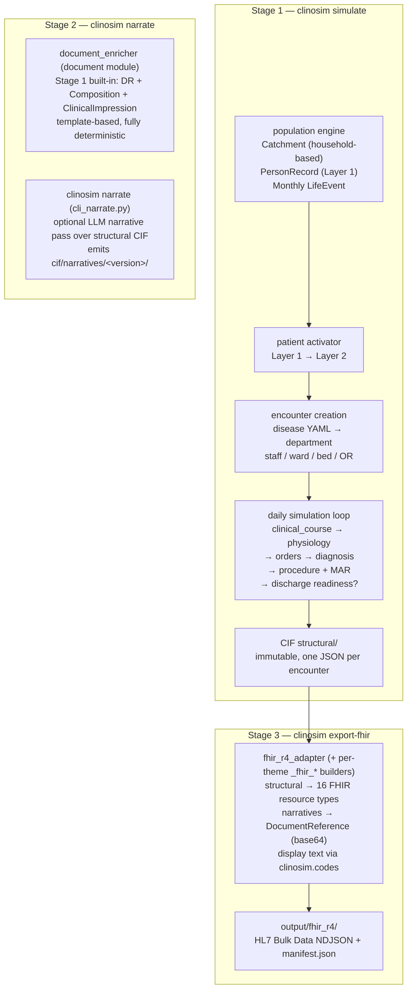
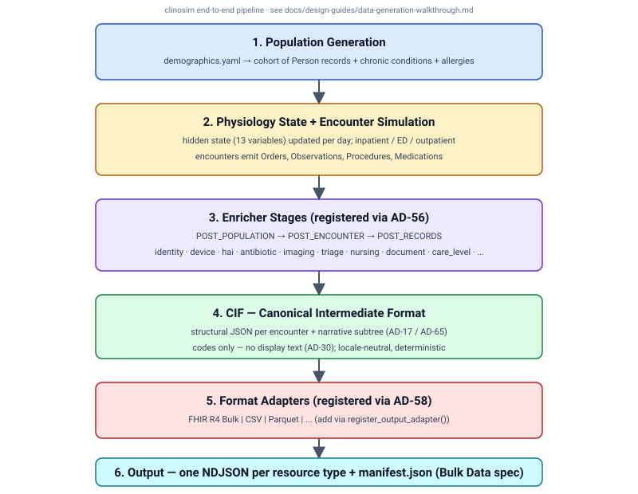

<!-- Extracted from `README.md` (Issue #568 PR A2). Update the pointer in README when this file's heading changes. -->

# Data Flow

clinosim implements a three-stage pipeline. Each stage is self-contained, has a well-defined input and output on disk, and can be run independently of the others.

**Why three stages?**

- **Reproducibility** — Stage 1 is fully deterministic from a seed (includes built-in document enricher). Stage 3 is a pure function of CIF.
- **Extensibility** — Stage 2 (`clinosim narrate`) is optional and wires in LLM narrative providers (local Ollama, AWS Bedrock, Sakura Cloud Ollama) over the same structural CIF. Skipping it still produces valid FHIR (template-mode `docStatus="preliminary"`).
- **Cost control** — Stage 2 is the only stage that may call a paid LLM API. Bedrock / Sakura runs can be isolated to a single remote invocation.
- **Remote execution** — Stage 2 can be run on a machine with network access to the LLM (e.g. EC2 for Bedrock, Sakura Cloud for Ollama), while Stage 1 and Stage 3 stay local.

### Snapshot Semantics

- Simulation period: `--start` ~ `--end`
- `--end` = **snapshot date**
- No life events generated past the snapshot date (no future admissions)
- Inpatients whose `discharge_datetime` would fall after the snapshot date:
  - `discharge_datetime = None`
  - `Encounter.status = "in-progress"`
  - Partial data only (labs/vitals/orders/MAR up to snapshot day)
  - Primary `Condition.clinicalStatus = "active"` (not resolved)
- This produces a realistic EHR snapshot **including currently admitted patients** (e.g., 50-bed × 60% occupancy ≈ 30 in-progress encounters)

---

## End-to-end pipeline diagram

For a step-by-step walkthrough see [`../design-guides/data-generation-walkthrough.md`](../design-guides/data-generation-walkthrough.md).
