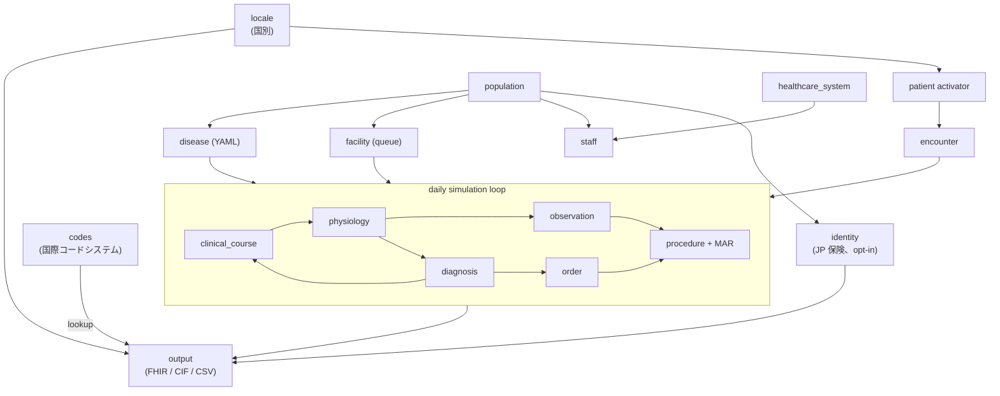

<!-- README.md から抽出 (Issue #568 PR A2)。本ファイルの見出しが変更されたら README のポインタを更新。 -->

# モジュール依存グラフ

`llm_service` と `validator` は cross-cutting (専用フェーズで使用)。
`identity` は opt-in enricher (AD-54): enricher registry (AD-56) 経由
の post-population pass として走行、そのデータは `output` が FHIR
`Coverage` として emit。

詳細は各モジュールの `clinosim/modules/<module>/README.md` 参照。

---
