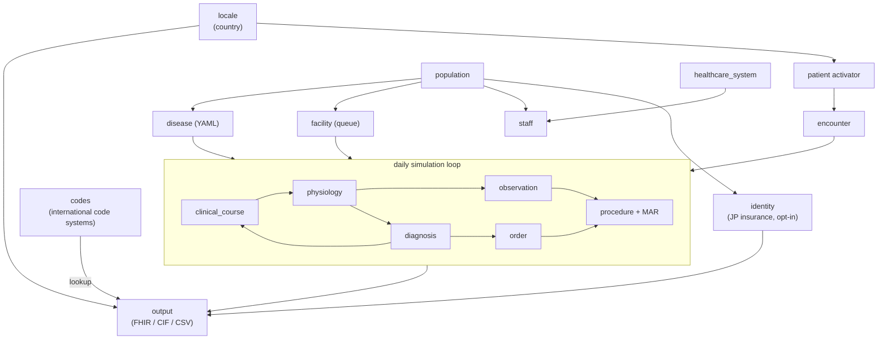

<!-- Extracted from `README.md` (Issue #568 PR A2). Update the pointer in README when this file's heading changes. -->

# Module Dependency Graph

`llm_service` and `validator` are cross-cutting (used in dedicated phases).
`identity` is an opt-in enricher (AD-54): it runs as a post-population pass via the
enricher registry (AD-56) and its data is emitted as FHIR `Coverage` by `output`.

See each module's `clinosim/modules/<module>/README.md` for details.

---
